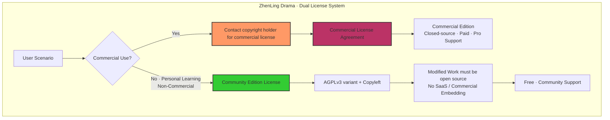

# 臻灵短剧 · 社区版许可协议

# ZhenLing Drama · Community Edition License

---

**Copyright © 2024-2026 ZhenLing Drama Team / 臻灵短剧团队**
**All Rights Reserved.**

---

## Article 1. General Provisions

This Agreement (hereinafter "**this Agreement**") governs all source code, documentation, and related resources of **ZhenLing Drama Community Edition** (hereinafter "**the Software**").

Before downloading, installing, using, or distributing the Software in any manner, please carefully read and understand all provisions of this Agreement. **By downloading, installing, using, or accepting the Software in any way, you agree to be bound by all terms of this Agreement.**

If you do not agree with any provision of this Agreement, please immediately cease all use of the Software and delete all obtained copies.

---

## Article 2. License Model

The Software adopts a **Dual License Model**:

| Version | License | Applicable Scenario |
|---|---|---|
| **Community Edition** | This Agreement (AGPLv3 variant + Commercial Restriction) | Personal learning, non-commercial creation, research |
| **Commercial Edition** | Separate Commercial License Agreement | Commercial closed-source derivative, commercial product sales |

> 📌 **Important Notice:** The "Community Edition License" and the "Commercial License" are two independent agreements. The Commercial Edition **must not** use this Agreement for authorization — a separate Commercial License Agreement must be signed with the copyright holder.

---

## Article 3. Community Edition License Terms

### 3.1 Scope of Authorization

Subject to all terms of this Agreement, the copyright holder grants you the following non-exclusive, non-transferable, limited rights:

- **Right to Use:** You may install and run the Software in compliance with all terms of this Agreement.
- **Right to Copy:** You may copy the source code or binary form of the Software for personal learning or non-commercial purposes.
- **Right to Modify:** You may modify the Software's source code (hereinafter "**Modified Work**"), provided that the Modified Work must comply with the relevant restrictions of this Agreement (see Section 3.2).
- **Right to Distribute:** Under the following conditions, you may distribute the Software or derivative works generated from the Software:
  - The distribution is non-commercial in nature;
  - You clearly inform recipients of the existence of this Agreement and provide the complete text of this Agreement;
  - You provide appropriate attribution to the copyright holder.

### 3.2 Modified Work Requirements (Copyleft Clause)

To ensure the open-source nature and ongoing community benefit of the Community Edition:

- Any **modifications, derivative works, or extensions** (including but not limited to: feature enhancements, bug fixes, UI adjustments, architectural refactoring) made to the Software, if distributed in any form, **must be licensed under this Agreement** — meaning the Modified Work must remain open source.
- **Prohibited Actions:** You may not release or embed the Modified Work into a commercial product via closed-source licensing, commercial licensing, or other restrictive means.
- **Reasonable Exception:** If you only use the Software for personal purposes (on no more than 3 devices) or internal research and do not publicly release it, the open-source obligation for the Modified Work is not triggered.

> 💡 **Note:** This clause is modeled after AGPLv3's share-alike provisions, designed to ensure that all contributions to the Community Edition remain open and benefit all users.

### 3.3 Trademarks and Attribution

- "**臻灵短剧**" (ZhenLing Drama) and related marks, names, and logos are registered trademarks or legally protected commercial marks of the copyright holder.
- You may not use the copyright holder's trademarks, brand names, or product names to promote, distribute, or market your modified version without written authorization from the copyright holder.
- When creating derivative projects based on the Software, you may state "基于臻灵短剧社区版开发" (English: "Based on ZhenLing Drama Community Edition"), but you may not imply any official partnership or endorsement from the copyright holder.

### 3.4 Intellectual Property Statement

- The Software is protected under the People's Republic of China's Copyright Law, the Computer Software Protection Regulations, and related international intellectual property treaties.
- This Agreement does not grant you any ownership or any rights beyond the intellectual property rights in the Software.
- You may not remove, alter, or circumvent any copyright notices, trademark notices, or license notices contained in the Software.

### 3.5 Disclaimer

**THE SOFTWARE IS PROVIDED "AS IS" WITHOUT ANY EXPRESS OR IMPLIED WARRANTIES, INCLUDING BUT NOT LIMITED TO:**

- WARRANTIES OF MERCHANTABILITY, FITNESS FOR A PARTICULAR PURPOSE, AND NON-INFRINGEMENT;
- WARRANTIES THAT THE SOFTWARE IS ERROR-FREE, FREE OF SECURITY VULNERABILITIES, OR MEETS YOUR SPECIFIC REQUIREMENTS;
- ANY DIRECT, INDIRECT, INCIDENTAL, SPECIAL, OR CONSEQUENTIAL DAMAGES (INCLUDING BUT NOT LIMITED TO: DATA LOSS, BUSINESS INTERRUPTION, LOSS OF PROFITS) arising from the use of, or inability to use, the Software — even if the copyright holder has been notified of the possibility of such damages — **under no theory of contract, tort, or otherwise shall the copyright holder be held liable**.

### 3.6 Indemnification

- You agree to indemnify, defend, and hold harmless the copyright holder from and against any third-party claims, lawsuits, losses, or expenses (including reasonable attorneys' fees) arising from your breach of this Agreement.

---

## Article 4. Commercial Edition Terms (Important)

### 4.1 Commercial Use Restrictions

> ⚠️ **Core Restriction Clause**

The following actions are **prohibited without prior written authorization** from the copyright holder:

| # | Prohibited Action | Description |
|---|---|---|
| 1 | **Embedding in Commercial Products** | Embed the Software (or a modified version) into any commercial product, software service, or SaaS platform for external provision |
| 2 | **SaaS / Cloud Services** | Use the Software as a core feature or significant component in a cloud service, hosting service, or any service charged to third parties |
| 3 | **Closed-Source Derivative** | Modify the Software and release or commercially sell the modification in closed-source form |
| 4 | **Batch Commercial Licensing** | License the Software (or its modified version) to multiple third parties for commercial purposes |
| 5 | **Excessive Commercial Use** | Deploy the Software on more than **5 servers** or **50 client devices** within a single corporate entity (personal non-commercial learning use excluded) |

> Once any of the above restrictions is triggered, it is deemed a commercial use scenario, requiring a separate **Commercial License Agreement** with the copyright holder and payment of applicable licensing fees.

### 4.2 Obtaining a Commercial License

To use the Software in a commercial scenario or if you have any need related to the prohibited actions above, please contact the copyright holder to obtain a commercial license quote:

- **Email:** [fill in contact email]
- **Address:** [fill in contact address]
- **Website:** [fill in official website]

The copyright holder will provide a customized commercial licensing plan based on your usage scale, feature requirements, and deployment scope.

### 4.3 Community vs. Commercial Edition

| Dimension | Community Edition | Commercial Edition |
|---|---|---|
| License Fee | Free | Paid (pricing by scale) |
| Source Code | Open source (AGPLv3 variant) | Closed source (separate agreement) |
| Features | Basic features + community contributions | Enhanced features + commercial features |
| Technical Support | Community forum (no SLA guarantee) | Professional support + SLA |
| Customization | Not provided | Deep customization available |
| Release Cycle | Follows community pace | Independent release cycle |

---

## Article 5. Termination of License

### 5.1 Automatic Termination

This Agreement automatically terminates upon your breach of any provision, without requiring further notice from the copyright holder. Upon termination, you must immediately:

- Cease all use of any and all copies of the Software (including any modified versions);
- Delete all copies of the Software and derivative works in your possession or control;
- Provide the copyright holder with written proof that you have fully complied with the above obligations.

### 5.2 Survival Provisions

Notwithstanding any termination of this Agreement for any reason, the following provisions shall survive termination:

- Sections 3.3, 3.4, 3.5, 3.6 of Article 3 (Community Edition License Terms);
- Article 4 (Commercial Edition Terms);
- Article 6 (Miscellaneous Provisions).

---

## Article 6. Miscellaneous Provisions

### 6.1 Agreement Amendments

The copyright holder reserves the right to amend any provision of this Agreement at any time. Amended provisions take effect through:

- Publishing the amended Agreement text in the Software's official repository ([fill in repository address]);
- 30-day prior notice for material amendments;
- Continued use of the Software after notice constitutes acceptance of the amended Agreement.

### 6.2 Governing Law and Dispute Resolution

- The interpretation, validity, and enforcement of this Agreement shall be governed by the laws of the **People's Republic of China**.
- Any dispute arising from or related to this Agreement shall first be resolved through friendly negotiation; if negotiation fails, either party may initiate litigation in the competent people's court at the copyright holder's domicile.

### 6.3 Severability

If any provision of this Agreement is found by a court of competent jurisdiction to be invalid or unenforceable, such provision shall be enforced to the maximum extent possible to fulfill the intent of both parties, and the remaining provisions of this Agreement shall remain in full force and effect.

### 6.4 Entire Agreement

This Agreement constitutes the entire agreement between you and the copyright holder regarding the Software, superseding any prior or contemporaneous agreements, understandings, or communications, whether oral or written, regarding the Software.

### 6.5 Contact Us

**Copyright Holder / 版权方：**
- **Name:** ZhenLing Drama Team / 臻灵短剧团队
- **Email:** [official@zhenling-drama.example.com]
- **Website:** [https://zhenling-drama.example.com]
- **Address:** [fill in registered address]

---

## Article 7. License Structure Diagram

---

> **Last Updated:** April 26, 2026
> **Version:** 1.0
> **Languages:** 中文（主版）/ English

---

*Thank you for reading this Agreement. If you have any questions, please contact the copyright holder via the channels above.*