<div align="center">

# 🔮 臻灵短剧 · ZhenLing Drama

**AI 短剧创作与生成平台 · AI Short Drama Generation Platform**

[功能模块](#功能模块) · [技术架构](#技术架构) · [快速开始](#快速开始) · [配置参考](#配置参考) · [API 文档](#api-文档)

[](LICENSE)
[](https://adoptium.net/)
[](https://spring.io/projects/spring-boot)
[](https://vuejs.org/)
[](https://www.typescriptlang.org/)

</div>

<h2 align="center">短剧合成效果展示</h2>

<video controls width="100%" style="max-width: 800px; display: block; margin: 0 auto;">
  <source src="./assets/%E7%9F%AD%E5%89%A7%E5%90%88%E6%88%90%E6%95%88%E6%9E%9CV1.mp4" type="video/mp4">
  Your browser does not support the video tag.
</video>

---

## 📞 联系我们

如果您对该项目感兴趣，或有定制开发的需求，可以扫描下方二维码联系我们：


|                   昱扬科技官网                   |                      开源技术交流群                      |
| :----------------------------------------------: | :------------------------------------------------------: |
|    |  |
| [https://www.yuyoung.cn](https://www.yuyoung.cn) |                                                          |

---

## 功能模块

### 1. 短剧管理 (Drama Management)

> **入口：** `/dramas` → 短剧列表页


| 功能      | 说明                                 |
| --------- | ------------------------------------ |
| 创建短剧  | 输入标题、描述、封面，初始化剧集结构 |
| 剧集管理  | 支持多集（Episode），每集独立分镜    |
| 删除/恢复 | 逻辑删除，保留数据可恢复             |

**数据模型：** `drama_id`, `title`, `description`, `cover_image`, `status`(draft/in_progress/completed), `total_episodes`, `created_episodes`

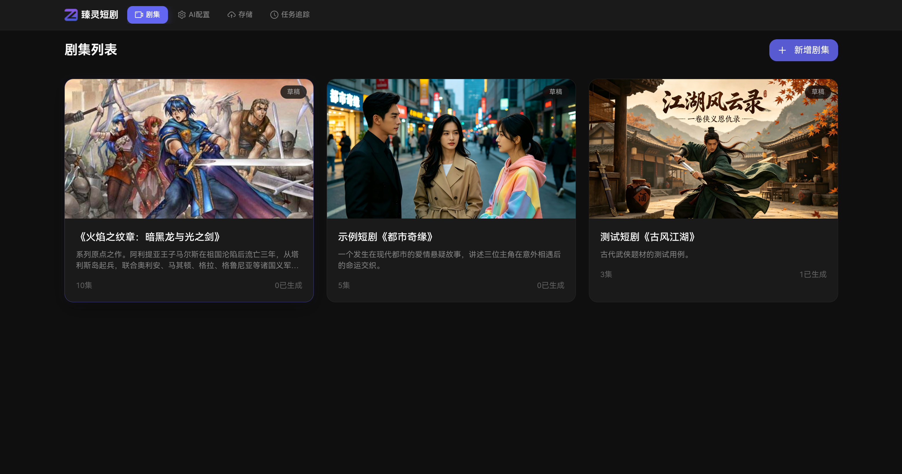

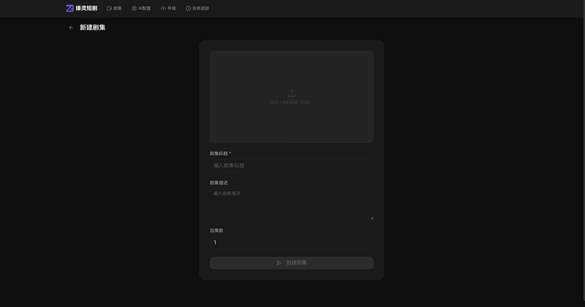

---

### 2. 工作台 (Workbench)

> **入口：** `/workbench/:dramaId` → 短剧创作工作台

工作台是核心创作界面，左侧分镜列表，右侧详情编辑。

**分镜（Storyboard）数据模型：**

- `scene_id` / `character_id(s)` → 绑定场景图和多角色图（支持多角色同时出现在同一分镜）
- `shot_type` → wide / medium / close-up / extreme-close-up
- `shot_direction` → 跟拍 / 固定镜头 / 航拍俯冲 ...
- `dialogue` → 台词（用于 TTS 和字幕）
- `action` → 动作描述（AI 生成提示词素材）
- `status` → pending / generating / completed / failed

**工作流程：**

```
用户输入剧本描述
       ↓
AI StoryboardService.generate()
       ↓
分镜自动拆分（镜头级颗粒度）
       ↓
① 场景图 AI 生成（SceneService）
② 角色图 AI 生成（ImageGenerationService）
③ 分镜参考图生成（ImageReferenceService）— 角色×场景预览图
④ 视频 AI 生成（VideoService → MiniMax/Hailuo）
⑤ 配音 AI 生成（TtsService）
       ↓
每个分镜: pending → generating → completed/failed
       ↓
整集合成: EpisodeExportService.compose()
       ↓
FFmpeg VideoComposeService + SubtitleRenderer + AudioSyncEngine
       ↓
输出完整 MP4，OSS 上传，数据库记录
```

**FEAT-003 分镜参考图生成：**

在正式视频合成前，为每个分镜生成"角色 × 场景"预览图，支持多角色图同时传入 MiniMax 多图参考合成，验证角色在场景中的实际效果后再触发高成本视频生成。

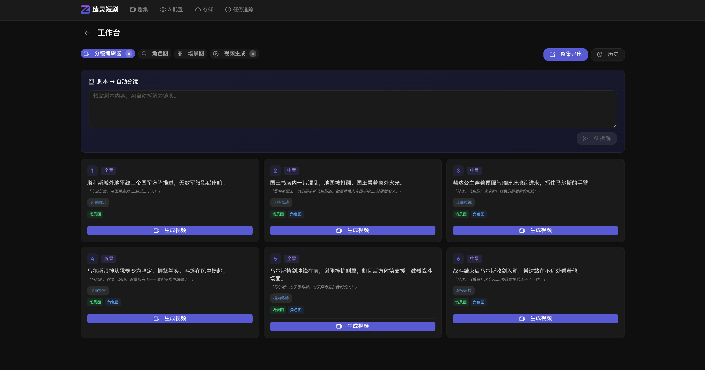

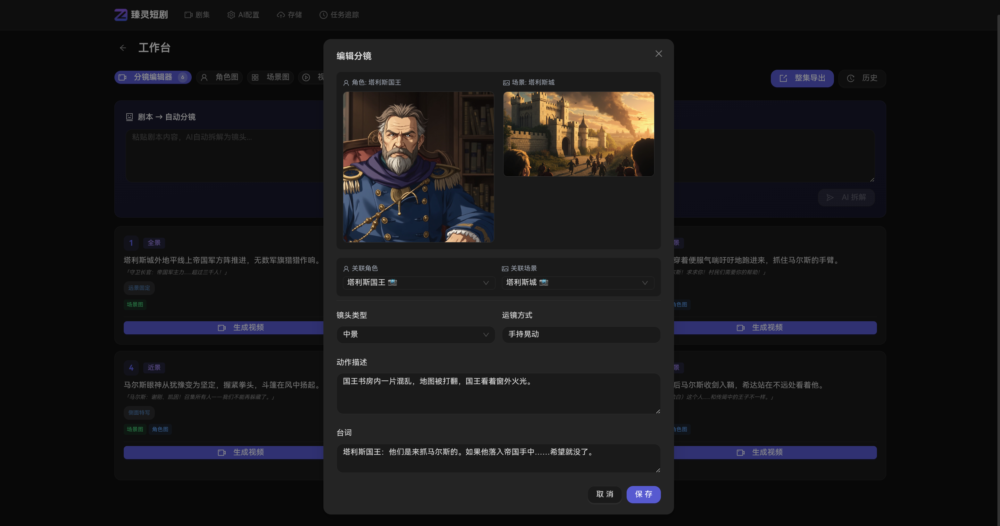

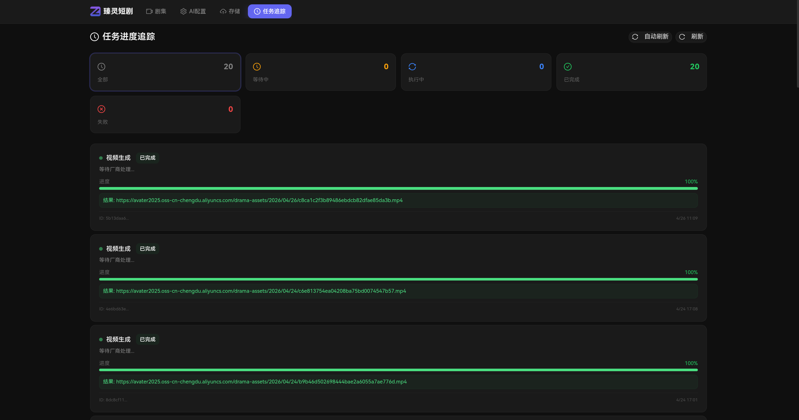

---

### 3. 媒体工作室 (Media Studio)

> **入口：** `/media/:dramaId` → 素材预览与编辑

- 分镜视频预览（在线播放）
- 分镜音频试听
- 视频片段裁剪预览
- 素材库管理（场景/角色/视频/音频分类浏览）
- **参考图自动填入**：从工作台跳转时自动填入已生成的参考图

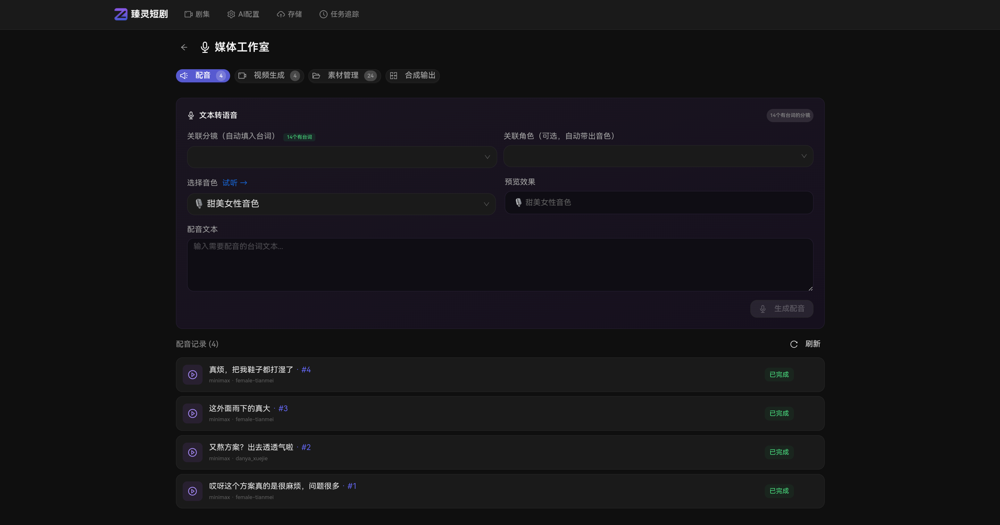

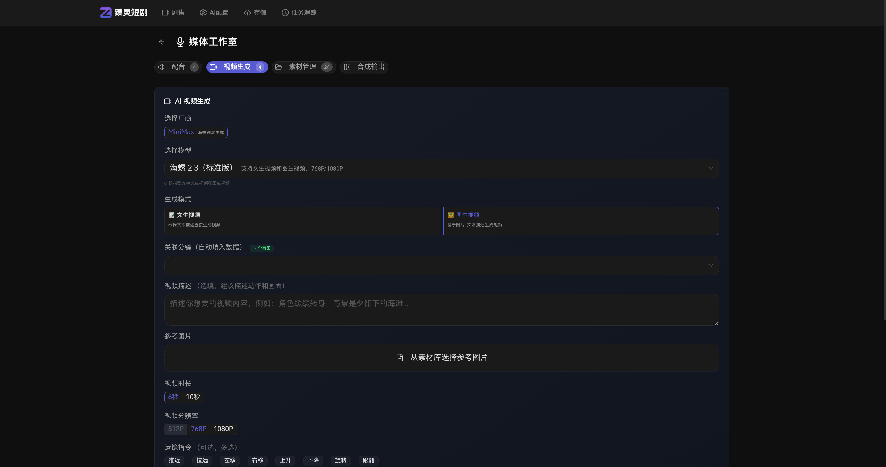

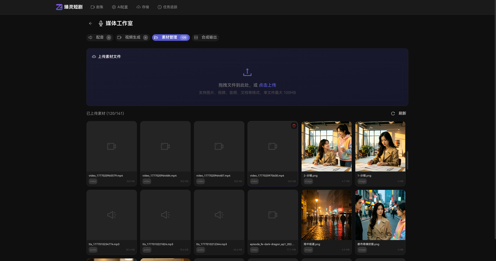

---

### 4. AI 配置中心 (AI Config)

> **入口：** `/settings/ai`


| 配置项          | 说明                                 |
| --------------- | ------------------------------------ |
| OpenAI API Key  | GPT-4o 图片生成 / 文本               |
| MiniMax API Key | 海螺视频 / TTS                       |
| 默认 Provider   | 指定默认 AI 厂商                     |
| 路由策略        | 按功能（text/image/video/tts）分厂商 |

**配置界面：** 表单式管理，Key 密文展示，保存后加密存储。

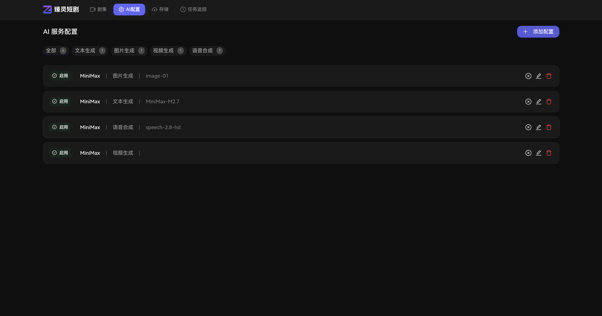

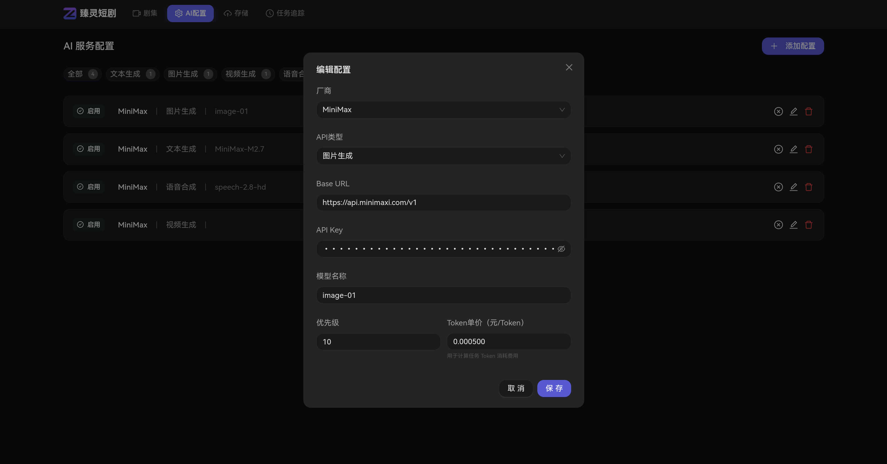

---

### 5. 存储配置 (Storage Settings)

> **入口：** `/settings/storage`


| 功能           | 说明                               |
| -------------- | ---------------------------------- |
| OSS 开关       | 启用/关闭阿里云 OSS                |
| Bucket 配置    | endpoint / bucket / 自定义域名     |
| AccessKey 管理 | AK/SK 密文管理                     |
| 存储状态       | 查看已用/总容量（需 OSS SDK 支持） |

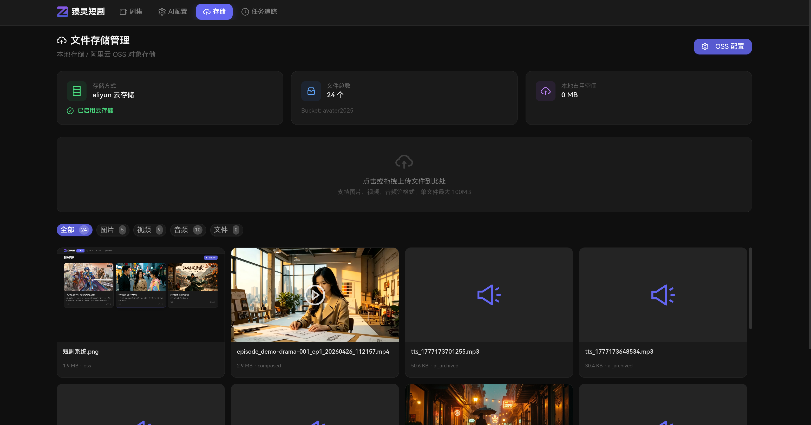

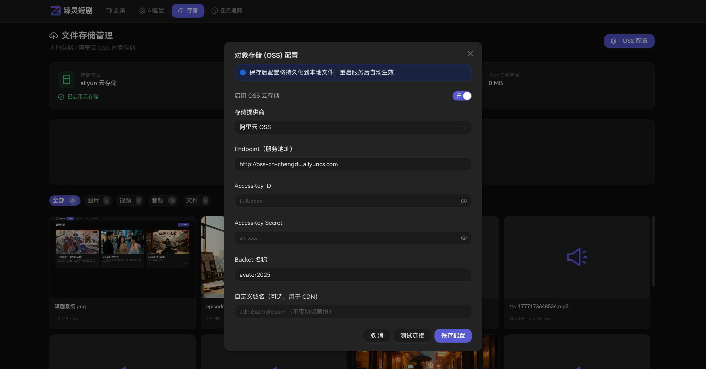

---

### 6. 任务追踪 (Task Tracker)

> **入口：** `/settings/tasks`

- 实时任务列表（生成中 / 成功 / 失败）
- 进度百分比展示
- 失败重试机制
- 历史任务记录（分页）

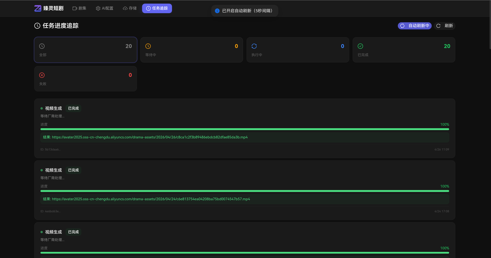

---

## 技术架构

### 系统架构图

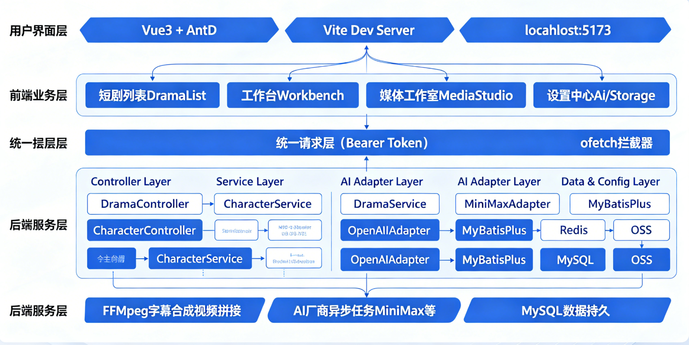

### 核心数据流

#### AI 视频生成流程

```
Browser                              Backend                               AI Provider
   │                                     │                                      │
   │ POST /api/v1/videos/generate        │                                      │
   │ { storyboard_id, provider }         │                                      │
   │───────────────────────────────────► │                                      │
   │                                     │ 验证 AI Config (ApiKey)
   │                                     │  ───────────────────────────────────►│
   │                                     │           API 调用
   │                                     │  ◄───────────────────────────────────│
   │                                     │   task_id (异步)
   │                                     │
   │  200 OK { task_id }                 │
   │◄────────────────────────────────────│
   │                                     │ (后台轮询)
   │                                     │  GET /query/{task_id}
   │                                     │  ───────────────────────────────────►│
   │                                     │  ◄───────────────────────────────────│
   │                                     │    video_url / failed
   │                                     │
   │                                     │   FFmpeg 合成（分镜级）
   │                                     │   上传 OSS / 保存本地
   │                                     │   更新 DB (video.url)
```

#### 整集合成流程 (Episode Export)

```
分镜列表（N 个分镜）
       │
       ├─ 分镜1: video_url + audio_url + dialogue → FFmpeg → 分镜1.mp4
       ├─ 分镜2: video_url + audio_url + dialogue → FFmpeg → 分镜2.mp4
       │    ...
       └─ 分镜N: ... → FFmpeg → 分镜N.mp4
              │
              ▼
    AudioSyncEngine（智能对齐：音频时长 > 视频时长 → PadSilence / ExtendFreeze）
              │
              ▼
    SubtitleRenderer（ASS 字幕烧录进视频）
              │
              ▼
    FFmpeg Concat（按顺序拼接所有分镜片段）
              │
              ▼
    OSS Upload + EpisodeExport Record
              │
              ▼
         最终 MP4 URL
```

### AI 适配器架构

```java
public interface AiAdapter {
    // 图片生成（支持多图参考）
    String generateImage(String prompt, String model);
    String generateImageWithReferences(String prompt, List<String> referenceImageUrls, String model);
    // 视频生成（返回 task_id）
    String generateVideo(String imageUrl, String prompt, String model, Integer duration, String resolution);
    // TTS
    String generateTTS(String text, String voiceId, String model);
    // 视频任务状态查询
    String pollVideoStatus(String taskId);
}
```

当前实现：

- `MiniMaxAdapter` — 海螺视频 v2.3 / TTS speech-02-hd / M2.5 文本 / **图片多图参考生成**
- `OpenAiAdapter` — DALL-E 图片 / GPT-4o 文本

### 数据库表结构


| 表名              | 说明                     |
| ----------------- | ------------------------ |
| `dramas`          | 短剧主表                 |
| `characters`      | 角色表（形象/声音）      |
| `scenes`          | 场景表（场景图/提示词）  |
| `storyboards`     | 分镜表（核心，含多角色） |
| `videos`          | 视频片段表               |
| `audios`          | 音频/TTS 表              |
| `assets`          | 资产文件表（OSS URL）    |
| `task_logs`       | 异步任务日志             |
| `episode_exports` | 整集导出记录             |
| `ai_configs`      | AI 配置（加密存储）      |

### 目录结构

```
zhenling-drama/
├── backend/                         # Java 17 + SpringBoot 3 后端
│   ├── src/main/java/com/drama/
│   │   ├── controller/                       # REST API
│   │   │   ├── ImageReferenceController.java # 分镜参考图接口（FEAT-003）
│   │   │   └── ...
│   │   ├── service/                          # 业务逻辑层
│   │   │   ├── ImageReferenceService.java   # 参考图生成（含多角色支持）
│   │   │   ├── ImageGenerationService.java   # AI 图片生成（含多图参考）
│   │   │   └── adapter/
│   │   │       ├── AiAdapter.java           # 统一接口（含 generateImageWithReferences）
│   │   │       └── MiniMaxAdapter.java      # MiniMax 多图参考实现
│   │   ├── entity/
│   │   │   └── Storyboard.java              # 含 characterIds 多角色字段
│   │   └── dto/
│   │       └── StoryboardRefStatus.java     # 批量参考图状态 DTO
│   └── sql/
│       └── zhenling_drama.sql
│
├── frontend/                        # Vue3 + Vite + TypeScript 前端
│   └── src/views/
│       ├── Workbench.vue            # ⭐ 分镜编辑器（含参考图批量面板）
│       └── MediaStudio.vue          # 素材预览（含参考图自动填入）
│
└── assets/                         # README 图片资源
```

---

## 快速开始

### 环境要求


| 依赖    | 版本 | 说明                       |
| ------- | ---- | -------------------------- |
| JDK     | 17+  | Lombok / SpringBoot 3 要求 |
| Maven   | 3.9+ |                            |
| Node.js | 18+  | 前端构建                   |
| MySQL   | 8.0+ |                            |
| Redis   | 6+   | 缓存 / 限流                |
| FFmpeg  | 任意 | `which ffmpeg` 验证        |

### 后端启动

```bash
cd backend

# 数据库初始化（如需新建）
mysql -u root -p < ../sql/zhenling_drama.sql

# 为已有数据库添加多角色字段
mysql -u zhenling_drama -pzhenling_drama zhenling_drama -e \
  "ALTER TABLE storyboards ADD COLUMN character_ids TEXT COMMENT '多角色ID列表（JSON数组）' AFTER scene_id;"

# 配置环境变量
export OSS_ACCESS_KEY_ID=your_key
export OSS_ACCESS_KEY_SECRET=your_secret

# 开发启动
mvn spring-boot:run
# 或指定 profile
mvn spring-boot:run -Dspring-boot.run.profiles=dev
```

> 后端地址：`http://localhost:8080`

### 前端启动

```bash
cd frontend
npm install
npm run dev
```

> 前端地址：`http://localhost:5173`（Vite Dev Server 自动代理 `/api` 到后端）

---

## 配置参考

**`application.yml` 核心配置项：**

```yaml
server:
  port: 8080

spring:
  datasource:
    url: jdbc:mysql://localhost:3306/zhenling_drama?useSSL=false&serverTimezone=Asia/Shanghai
    username: zhenling_drama
    password: ${MYSQL_PASSWORD:zhenling_drama}

oss:
  enabled: true
  provider: aliyun
  endpoint: http://oss-cn-chengdu.aliyuncs.com
  access-key-id: ${OSS_ACCESS_KEY_ID}
  access-key-secret: ${OSS_ACCESS_KEY_SECRET}
  bucket-name: your-bucket
  base-path: drama-assets

cors:
  allowed-origins:
    - http://localhost:5173

ai:
  default-text-provider: minimax
  default-image-provider: minimax   # MiniMax-Image-01（支持多图参考）
  default-video-provider: minimax
  default-tts-provider: minimax

ffmpeg:
  path: ""
```

---

## API 文档

Base path: `/api/v1/`


| 方法   | 路径                              | 说明                         |
| ------ | --------------------------------- | ---------------------------- |
| GET    | `/dramas`                         | 获取短剧列表                 |
| POST   | `/dramas`                         | 创建短剧                     |
| GET    | `/dramas/{id}`                    | 获取短剧详情                 |
| PUT    | `/dramas/{id}`                    | 更新短剧                     |
| DELETE | `/dramas/{id}`                    | 删除短剧                     |
| GET    | `/storyboards/drama/{dramaId}`    | 获取分镜列表                 |
| POST   | `/storyboards/generate`           | AI 生成分镜                  |
| PUT    | `/storyboards/{id}`               | 更新分镜（含多角色字段）     |
| POST   | `/image-reference/generate`       | 生成分镜参考图（多角色支持） |
| GET    | `/image-reference/{storyboardId}` | 获取分镜参考图               |
| GET    | `/image-reference/list/{dramaId}` | 批量获取参考图状态           |
| DELETE | `/image-reference/{storyboardId}` | 删除参考图                   |
| POST   | `/videos/generate`                | AI 生成视频（异步）          |
| GET    | `/videos/{id}`                    | 查询视频状态                 |
| POST   | `/audios/tts`                     | AI 配音                      |
| POST   | `/exports/compose`                | 整集合成为成片               |
| GET    | `/ai-configs`                     | 获取 AI 配置列表             |
| POST   | `/ai-configs`                     | 创建/更新 AI 配置            |
| GET    | `/task-logs`                      | 任务日志列表                 |

---

## 许可证

[LICENSE](LICENSE)
