<h2 align="center">Short Drama Composition Showcase</h2>


# Zhenling Short Drama Platform · User Manual

> This manual is for general users and provides detailed instructions on how to use all features of the platform.
> Interface elements such as buttons and input fields are marked with **「」** in this manual.

---

## Table of Contents

1. [Product Overview](#1-product-overview)
2. [Quick Start Guide](#2-quick-start-guide)
3. [Drama Management](#3-drama-management)
4. [AI Configuration](#4-ai-configuration)
5. [Storage Settings](#5-storage-settings)
6. [Task Tracking](#6-task-tracking)
7. [Complete Short Drama Production Tutorial](#7-short-drama-production-tutorial)
8. [FAQ](#8-faq)
9. [Appendix](#appendix)

---

## 1. Product Overview

### 1.1 Platform Introduction

Zhenling Short Drama is an AI-powered automated short drama production platform, covering the full workflow from **Script Input → AI Storyboard → Character Design → TTS Voiceover → Video Generation → Export**.

Users only need to provide a script, and the platform will automatically complete storyboard splitting, character image generation, voice synthesis, video generation, and finally output a complete short drama.

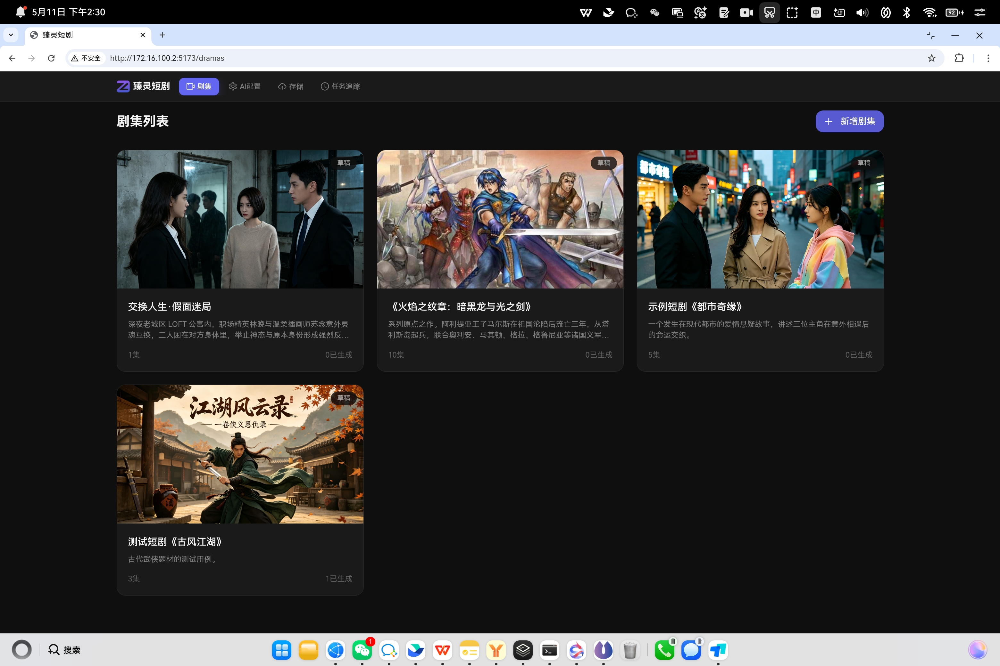

---

### 1.2 Feature Modules


| Module        | Location                 | Description                                          |
| ------------- | ------------------------ | ---------------------------------------------------- |
| **Dramas**    | Top Navigation, 1st Item | Short drama project overview, create/manage projects |
| **AI Config** | Top Navigation, 2nd Item | Configure AI vendor API Keys                         |
| **Storage**   | Top Navigation, 3rd Item | Configure video/image storage locations              |
| **Tasks**     | Top Navigation, 4th Item | View background async task execution status          |

---

### 1.3 Top Navigation Bar

The platform's top navigation bar is a global navigation. No matter which page you are on, you can quickly switch using the top navigation bar:


| Navigation Item | Goes To                           |
| --------------- | --------------------------------- |
| **Dramas**      | Drama list page, project overview |
| **AI Config**   | AI vendor API configuration page  |
| **Storage**     | Storage location settings page    |
| **Tasks**       | Async task progress view page     |

> **Tip**: The current navigation item is usually highlighted (e.g., blue or bold).
>
> 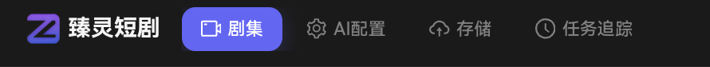

---

## 2. Quick Start Guide

### 2.1 First-Time Use Checklist

Before starting drama production, please complete configuration and operations in the following order:

```
□ Step 1: Configure AI Vendor API Key
        └─ Entry: Top Navigation → AI Config

□ Step 2: Configure Storage Location
        └─ Entry: Top Navigation → Storage

□ Step 3: Create Your First Drama
        └─ Entry: Top Navigation → Dramas

□ Step 4: Import Script and AI Analysis
        └─ Entry: Open Drama Details → Storyboard Tab → AI Analyze Script

□ Step 5: Design Characters
        └─ Entry: Open Drama Details → Characters Tab

□ Step 6: Create Storyboard
        └─ Entry: Open Drama Details → Storyboard Tab

□ Step 7: Generate Voiceover
        └─ Entry: Open Drama Details → Media Studio → Voiceover Tab

□ Step 8: Generate Video
        └─ Entry: Open Drama Details → Media Studio → Video Tab

□ Step 9: Export
        └─ Entry: Open Drama Details → Media Studio → Export Tab
```

---

### 2.2 Core Production Flow Diagram

```
                    【Step 1】Input Script
                         ↓
                    AI Analyze Script
                    ↓  Auto-generate scenes and storyboards
                    ↓
                    【Step 2】Character Design
                    ↓  Set appearance for each character
                    ↓
                    【Step 3】Storyboard Design
                    ↓  Optimize visual description (prompt) for each shot
                    ↓
                    【Step 4】TTS Voiceover
                    ↓  Add voice lines to storyboards
                    ↓
                    【Step 5】Video Generation
                    ↓  AI generates video clips
                    ↓
                    【Step 6】Export
                         ↓
                    Combine all video clips into a complete drama
```

---

## 3. Drama Management

Entry: **Top Navigation → Dramas**

---

### 3.1 Drama List Page

#### 3.1.1 Page Layout


| Area          | Description                       |
| ------------- | --------------------------------- |
| Page Title    | Shows "Dramas"                    |
| Create Button | "New Drama" button in upper right |
| Search Box    | Search by drama name              |
| Drama Cards   | Arranged drama cards              |
| Pagination    | Pagination when many dramas exist |

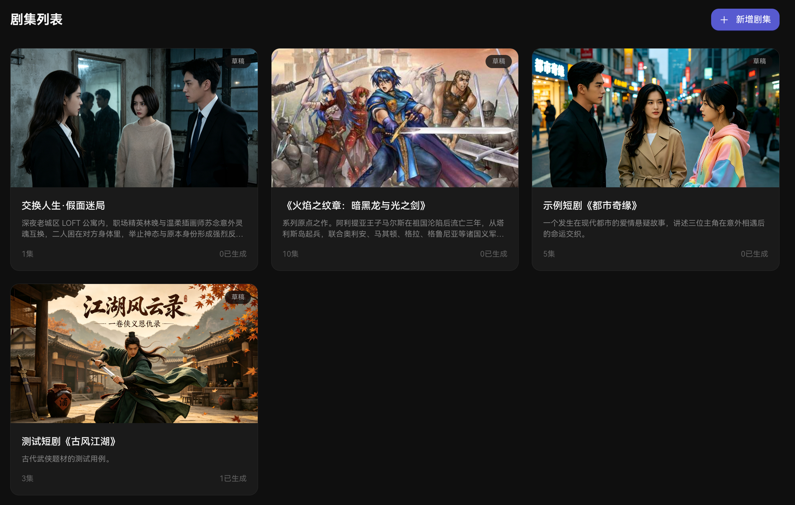

#### 3.1.2 Drama Card Content


| Item        | Description                       |
| ----------- | --------------------------------- |
| Cover Image | Drama showcase cover              |
| Drama Title | Drama name                        |
| Episodes    | Total number of episodes          |
| Status      | Draft / In Production / Completed |
| Created     | Creation date                     |

#### 3.1.3 Drama Card Actions


| Action        | Function                                  |
| ------------- | ----------------------------------------- |
| Click Card    | Open Drama Details page                   |
| "View"/"Open" | Open Drama Details page                   |
| "Edit"        | Edit drama basic info                     |
| "Delete"      | Delete this drama (requires confirmation) |

---

### 3.2 Create New Drama

#### 3.2.1 Open Create Dialog

**Step 1**: On the Drama List page, click the **「New Drama」** button in the upper right corner.

**Step 2**: A form dialog for creating a new drama will appear.

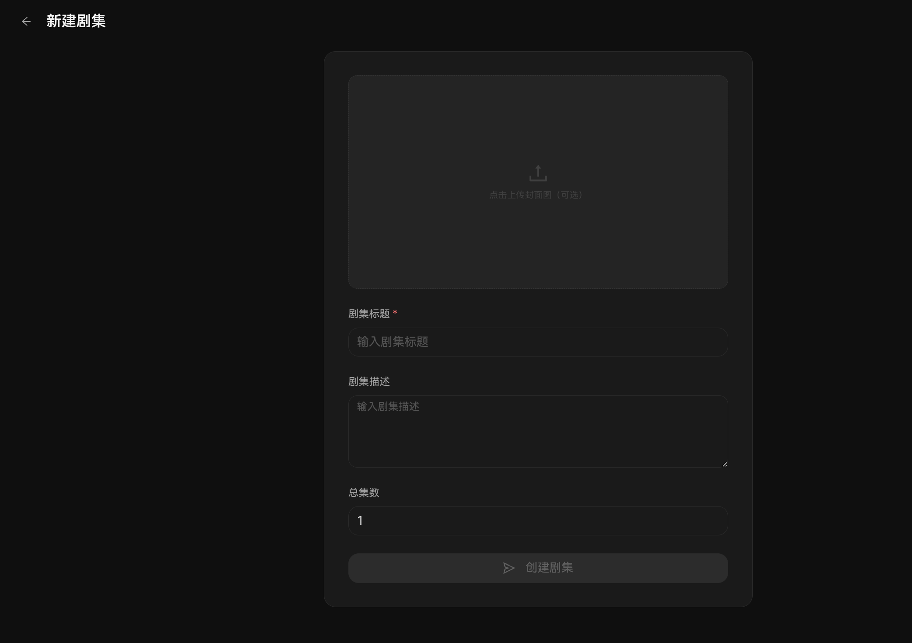

#### 3.2.2 Fill in Drama Information


| Field              | Description              | Required                | Example                                   |
| ------------------ | ------------------------ | ----------------------- | ----------------------------------------- |
| **Drama Title**    | Name of the short drama  | ✅ Required             | Life Swap · Mask Mystery                 |
| **Cover Image**    | Cover image for list     | ❌ Optional             | Click upload button to select image       |
| **Description**    | Brief plot description   | ❌ Optional             | An identity swap caused by an accident... |
| **Total Episodes** | Total number of episodes | ✅ Required (default 1) | 10                                        |

**Filling Steps**:

- **Step 1**: Enter the drama name in the "Drama Title" input field

  > Suggestion: Keep names short and powerful, 4-12 characters recommended
  >
- **Step 2** (Optional): Click the cover area to upload an image, or drag and drop an image to the cover area

  > Supported formats: JPG, PNG; Recommended size: 16:9 or 3:4
  >
- **Step 3** (Optional): Fill in a brief description in the "Description" input field
- **Step 4**: Fill in the total number of episodes in the "Total Episodes" input field (default is 1)

  > If producing a single-episode short drama, keep the default value of 1
  >

#### 3.2.3 Confirm Creation

**Step 3**: Click the **「Create Drama」** button at the bottom of the dialog.

**Step 4**: After successful creation:

- Dialog closes automatically
- A new drama record appears in the list
- Automatically redirects to the Drama Details page

---

### 3.3 Drama Details Page

#### 3.3.1 Enter Details Page

Click any drama card on the Drama List page to enter that drama's details page.

#### 3.3.2 Page Layout Overview

The Drama Details page contains the following feature tabs:


| Tab            | Description                       |
| -------------- | --------------------------------- |
| **Characters** | Add/edit/delete character images  |
| **Scenes**     | Add/edit/delete scene backgrounds |
| **Storyboard** | View/edit/add storyboards         |
| **Settings**   | Modify basic drama info           |

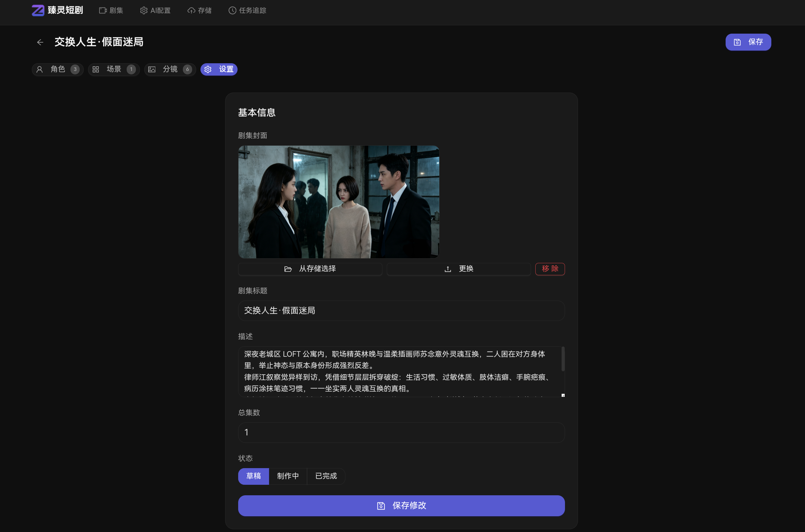

#### 3.3.3 Settings Tab

In the "Settings" tab, you can modify:


| Field       | Description                       |
| ----------- | --------------------------------- |
| Cover       | Upload/replace cover image        |
| Title       | Modify drama name                 |
| Description | Modify plot description           |
| Episodes    | Modify total episodes             |
| Status      | Draft / In Production / Completed |

> **Status Description**:
>
> - **Draft**: Newly started drama production
> - **In Production**: Currently being produced
> - **Completed**: Production finished

---

## 4. AI Configuration

Entry: **Top Navigation → AI Config**

---

### 4.1 Why Configure AI

The platform uses AI vendors to complete the following functions:


| AI Function                | Purpose                                                              |
| -------------------------- | -------------------------------------------------------------------- |
| **Text Generation**        | Understand script content, split scenes                              |
| **Image Generation**       | Generate character images, scene images, storyboard reference images |
| **Video Generation**       | Convert storyboard descriptions into video clips                     |
| **Speech Synthesis (TTS)** | Convert text lines into voice                                        |

> **Important**: Before using the platform for the first time, you must complete AI configuration, otherwise no generation features will be available.

---

### 4.2 Supported AI Vendors


| Vendor            | Description                                  | Supported API Types     |
| ----------------- | -------------------------------------------- | ----------------------- |
| **MiniMax**       | Hailuo Video is the main model               | text, image, video, tts |
| **Volcengine**    | Doubao/Volcengine, supports audio-video sync | video, tts              |
| **OpenAI**        | GPT series models                            | text, image             |
| **Google Gemini** | Gemini series models                         | text, image             |
| **Alibaba Cloud** | Alibaba Cloud AI service                     | text, image             |

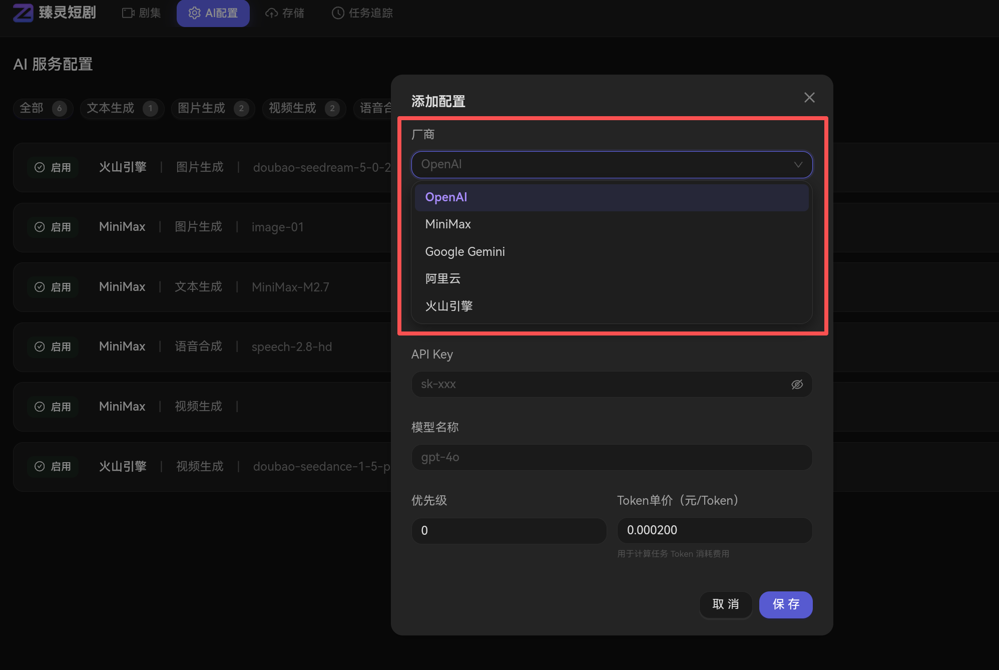

---

### 4.3 AI Configuration Page Layout

#### 4.3.1 Page Components


| Area             | Description                                                                                                |
| ---------------- | ---------------------------------------------------------------------------------------------------------- |
| Page Title       | Shows "AI Service Configuration"                                                                           |
| Add Button       | "Add Config" button in upper right                                                                         |
| Type Filter Tabs | Filter configs by API type: All / Text Generation / Image Generation / Video Generation / Speech Synthesis |
| Config List      | Shows all added AI configurations                                                                          |
| Config Card      | Each card displays vendor, API type, model name, enabled status                                            |

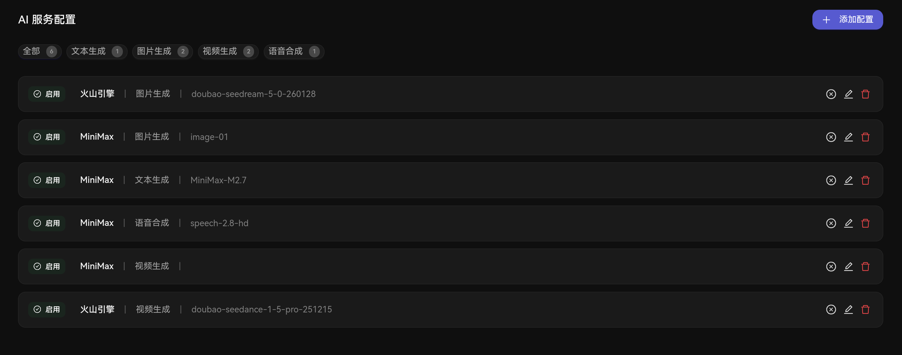

#### 4.3.2 Filter Function

Click different type filter tabs to quickly view all configurations of that type:


| Filter Tab       | Description                  |
| ---------------- | ---------------------------- |
| All              | Show all AI configs          |
| Text Generation  | Show text type configs only  |
| Image Generation | Show image type configs only |
| Video Generation | Show video type configs only |
| Speech Synthesis | Show tts type configs only   |

> **Tip**: Each tab shows the count of configurations for that type.

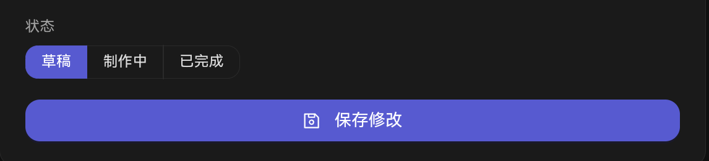

---

### 4.4 Add AI Configuration

#### 4.4.1 Open Add Dialog

**Step 1**: On the AI Configuration page, click the **「Add Config」** button in the upper right corner.

**Step 2**: An add configuration form dialog appears.

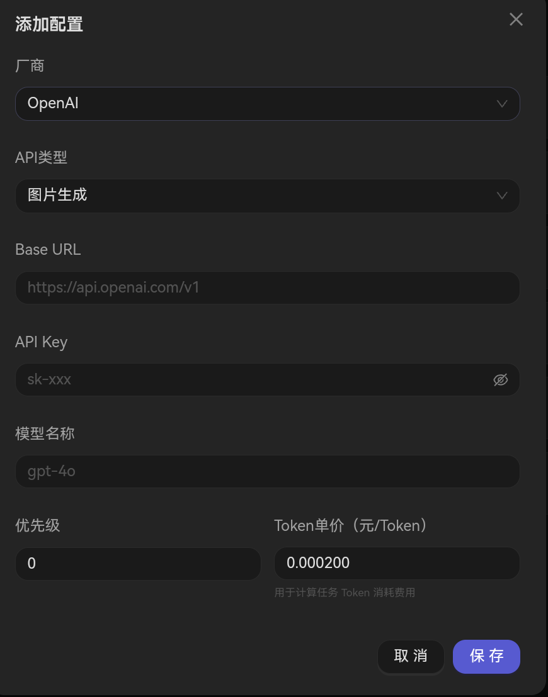

#### 4.4.2 Fill in Configuration Information


| Field           | Description                                 | Required                | Example/Note                        |
| --------------- | ------------------------------------------- | ----------------------- | ----------------------------------- |
| **Vendor**      | AI service provider                         | ✅ Required             | Select vendor                       |
| **API Type**    | What function this config is for            | ✅ Required             | Select API type                     |
| **Base URL**    | API interface address                       | ✅ Required             | Different default values per vendor |
| **API Key**     | Access key                                  | ✅ Required             | Get from vendor platform            |
| **Model Name**  | Specific model being used                   | ✅ Required             | e.g., gpt-4o, speech-02-hd          |
| **Priority**    | Priority when multiple configs of same type | ✅ Required (default 0) | Smaller number = higher priority    |
| **Token Price** | Price per Token (¥/Token)                  | ❌ Optional             | Used for calculating task costs     |

#### 4.4.3 Vendor Notes


| Vendor            | Default Base URL                               | Description                   |
| ----------------- | ---------------------------------------------- | ----------------------------- |
| **MiniMax**       | `https://api.minimaxi.com/v1`                  | Hailuo Video, TTS main vendor |
| **Volcengine**    | `https://ark.cn-beijing.volces.com/api/v3`     | Doubao/Volcengine             |
| **OpenAI**        | `https://api.openai.com/v1`                    | GPT series models             |
| **Google Gemini** | `https://generativelanguage.googleapis.com/v1` | Gemini series models          |
| **Alibaba Cloud** | Needs to be filled in                          | Alibaba Cloud AI service      |

#### 4.4.4 API Type Notes


| API Type             | Purpose                          | Common Models                               |
| -------------------- | -------------------------------- | ------------------------------------------- |
| **Text Generation**  | Script analysis, scene splitting | gpt-4o, gpt-3.5-turbo                       |
| **Image Generation** | Generate character/scene images  | dall-e-3, stable-diffusion                  |
| **Video Generation** | Generate video clips             | MiniMax-Hailuo-2.3, doubao-seedance-1-5-pro |
| **Speech Synthesis** | TTS voiceover                    | speech-02-hd                                |

#### 4.4.5 Priority Notes

Multiple vendors can be configured for the same API type. **Smaller priority numbers have higher priority**.

**Example**: Multiple video generation configurations


| Config   | Vendor     | API Type | Priority | Effect                         |
| -------- | ---------- | -------- | -------- | ------------------------------ |
| Config A | MiniMax    | video    | 0        | **Used first**                 |
| Config B | Volcengine | video    | 1        | Used when Config A unavailable |

#### 4.4.6 Token Price Notes

Token price is used to calculate actual task costs.

> **Tip**: If you don't fill in the token price, you won't be able to accurately calculate task costs, but AI features can still be used normally.

#### 4.4.7 Confirm Addition

**Step 3**: After filling in the information, click the **「Save」** button.


---

### 4.5 Manage Existing Configurations

#### 4.5.1 Config Card Content

Each config card displays:


| Information      | Description                                    |
| ---------------- | ---------------------------------------------- |
| Enabled/Disabled | Shows green "Enabled" or gray "Disabled" label |
| Vendor Name      | e.g., MiniMax, Volcengine                      |
| API Type         | e.g., Text Generation, Image Generation        |
| Model Name       | Specific model name                            |

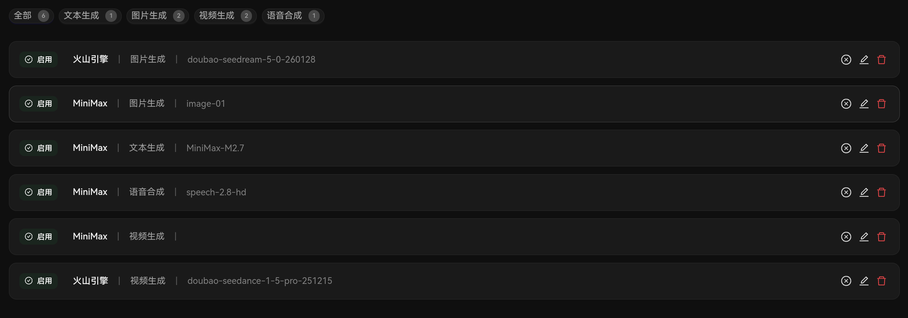

#### 4.5.2 Config Operations


| Operation                 | Function                                                   |
| ------------------------- | ---------------------------------------------------------- |
| **Enable/Disable Toggle** | Click the circle icon to toggle enabled status             |
| **Edit**                  | Click edit icon to modify configuration info               |
| **Delete**                | Click delete icon to delete config (requires confirmation) |

> **Tip**: Disabled configs won't take effect but won't be deleted, can be enabled anytime.

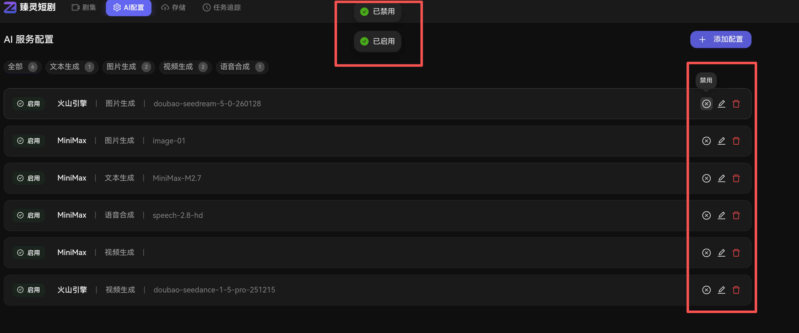

---

### 4.6 Configuration Examples

#### 4.6.1 MiniMax Text Generation Config


| Field      | Content                         |
| ---------- | ------------------------------- |
| Vendor     | MiniMax                         |
| API Type   | Text Generation                 |
| Base URL   | `https://api.minimaxi.com/v1`   |
| API Key    | Get from MiniMax Open Platform  |
| Model Name | (Optional or fill like`gpt-4o`) |
| Priority   | 0                               |

#### 4.6.2 MiniMax TTS Config


| Field      | Content                        |
| ---------- | ------------------------------ |
| Vendor     | MiniMax                        |
| API Type   | Speech Synthesis               |
| Base URL   | `https://api.minimaxi.com/v1`  |
| API Key    | Get from MiniMax Open Platform |
| Model Name | `speech-02-hd`                 |
| Priority   | 0                              |

#### 4.6.3 Volcengine Video Generation Config


| Field      | Content                                    |
| ---------- | ------------------------------------------ |
| Vendor     | Volcengine                                 |
| API Type   | Video Generation                           |
| Base URL   | `https://ark.cn-beijing.volces.com/api/v3` |
| API Key    | Get from Volcengine Console                |
| Model Name | `doubao-seedance-1-5-pro-251215`           |
| Priority   | 1                                          |

---

## 5. Storage Settings

Entry: **Top Navigation → Storage**

---

### 5.1 Purpose of Storage

The platform needs storage locations for generated files:


| File Type      | Example                                 |
| -------------- | --------------------------------------- |
| Video files    | .mp4 format video clips                 |
| Image files    | .jpg/.png format character/scene images |
| Audio files    | .mp3/.wav format voiceover audio        |
| Subtitle files | .ass format subtitle files              |

**Storage Location Options**:

- **Cloud Storage (OSS)**: Alibaba Cloud Object Storage, recommended for production environments
- **Local Storage**: Server local disk, suitable for testing/development environments

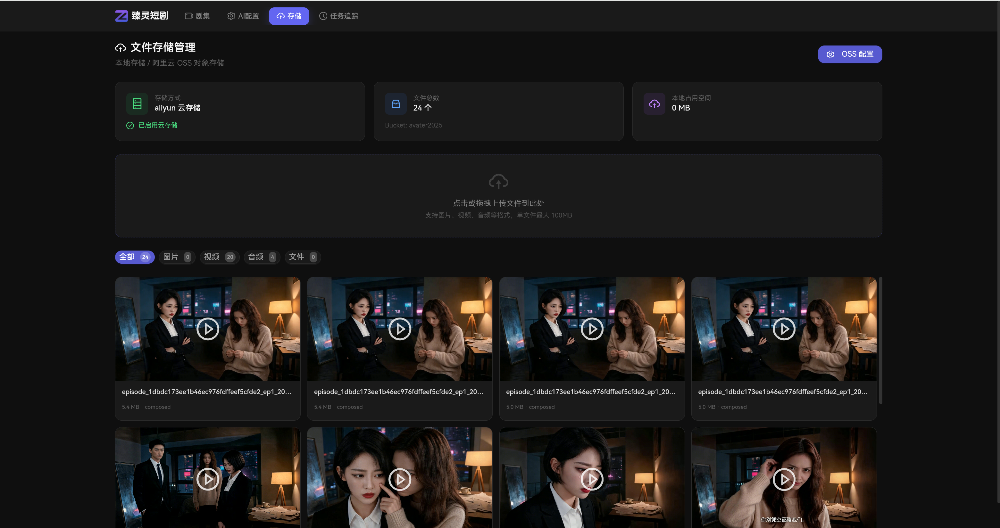

---

### 5.2 Configure Alibaba Cloud OSS

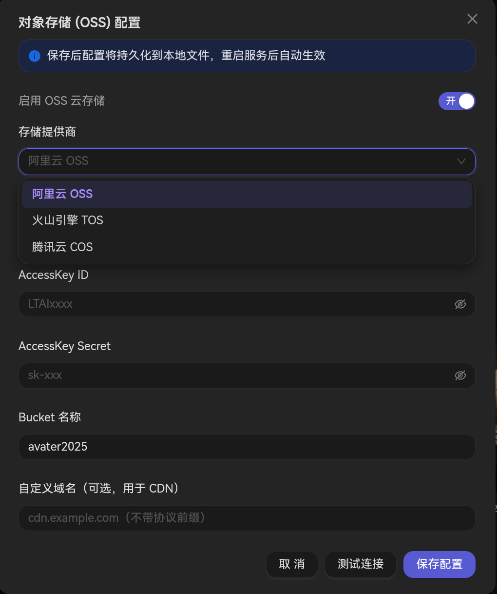

#### 5.2.1 Fill in OSS Configuration Information


| Field                | Description                    | Example                        |
| -------------------- | ------------------------------ | ------------------------------ |
| **Endpoint**         | OSS service address            | `oss-cn-chengdu.aliyuncs.com`  |
| **AccessKey ID**     | Alibaba Cloud AccessKey ID     | Get from Alibaba Cloud Console |
| **AccessKey Secret** | Alibaba Cloud AccessKey Secret | Get from Alibaba Cloud Console |
| **Bucket Name**      | OSS bucket name                | e.g.,`my-drama-bucket`         |
| **Custom Domain**    | (Optional) ICP-filed domain    | e.g.,`cdn.example.com`         |

#### 5.2.2 Endpoint Notes

Different regions have different endpoints. Use the region where you actually created the bucket:


| Region   | Endpoint Example               |
| -------- | ------------------------------ |
| Chengdu  | `oss-cn-chengdu.aliyuncs.com`  |
| Beijing  | `oss-cn-beijing.aliyuncs.com`  |
| Shanghai | `oss-cn-shanghai.aliyuncs.com` |
| Shenzhen | `oss-cn-shenzhen.aliyuncs.com` |

#### 5.2.3 Confirm Save

Click the **「Save」** button.

> **Tip**: After saving, it is recommended to test if the connection is normal.

---

### 5.3 Configure Local Storage

#### 5.3.1 Select Local Storage Mode

If you see a mode selection on the Storage Settings page, select the **「Local Storage」** option.

#### 5.3.2 Set Local Storage Path


| Field    | Description                                     |
| -------- | ----------------------------------------------- |
| **Path** | Local disk directory, e.g.,`/data/drama-files/` |

> **Tip**: Local storage is suitable for development and testing environments. For production environments, it is recommended to use OSS cloud storage.

---

## 6. Task Tracking

Entry: **Top Navigation → Tasks**

---

### 6.1 What Are Async Tasks

AI generation operations (such as video generation, voice synthesis) are **async tasks**:


| Sync Tasks                            | Async Tasks                                                     |
| ------------------------------------- | --------------------------------------------------------------- |
| Click and wait for result immediately | Submit and execute in background, front-end returns immediately |
| Suitable for short operations         | Suitable for time-consuming (e.g., 2-10 minutes) operations     |

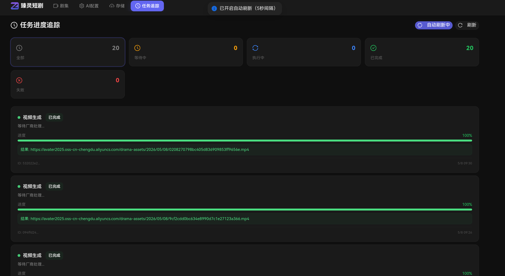

---

### 6.2 Task Status Description


| Status           | Indicator | Meaning                            |
| ---------------- | --------- | ---------------------------------- |
| ⏳**Pending**    | Blue      | Task submitted, waiting to execute |
| 🔄**Processing** | Yellow    | Currently executing                |
| ✅**Completed**  | Green     | Task completed, result available   |
| ❌**Failed**     | Red       | Task failed, can view error reason |

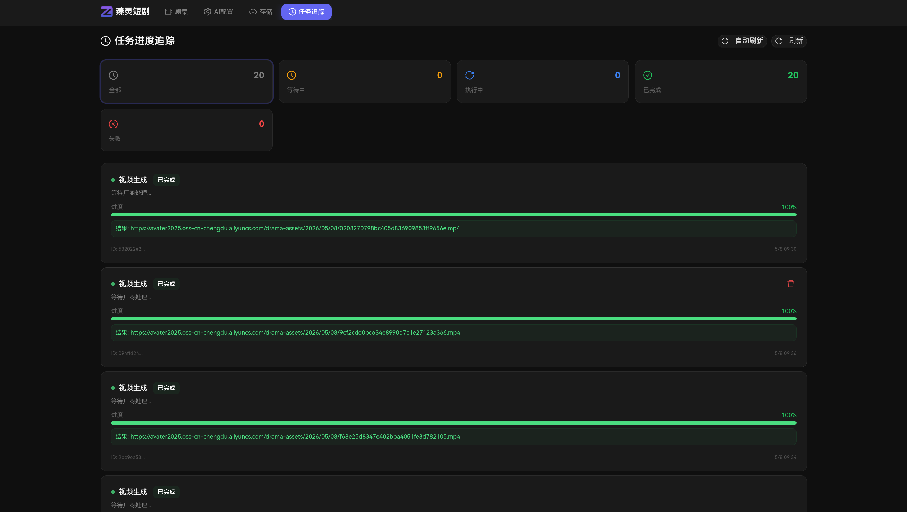

---

### 6.3 View Task Details

**Step 1**: Find the task to view in the task list, click that row or the "View Details" button.

**Step 2**: View in the details dialog:


| Information        | Description                            |
| ------------------ | -------------------------------------- |
| Task Type          | Video Generation / Voice Synthesis     |
| Related Storyboard | Drama and storyboard number            |
| Submit Time        | Task start time                        |
| Complete Time      | Task end time (shown after completion) |
| Duration           | Total time taken                       |
| Status             | Current status                         |
| Error Info         | Specific error reason when failed      |

---

### 6.4 Task Failure Handling

#### 6.4.1 Common Errors and Solutions


| Error Type            | Possible Cause                                      | Solution                                 |
| --------------------- | --------------------------------------------------- | ---------------------------------------- |
| Invalid API Key       | Key expired or filled incorrectly                   | Go to AI Config page to update API Key   |
| Insufficient Balance  | Account balance insufficient                        | Recharge at AI vendor platform           |
| Unsupported Parameter | Model doesn't support current parameter combination | Adjust parameters and retry              |
| Network Timeout       | Network connection issue                            | Click "Retry", usually a temporary issue |
| Task Timeout          | AI vendor processing timeout                        | Wait a while and retry                   |

#### 6.4.2 Retry Task

**Step 3**: After confirming the problem is resolved, click the **「Retry」** button to re-execute the task.


---

## 7. Short Drama Production Tutorial

---

### 7.1 Create Drama

#### 7.1.1 Operation Path

```
Drama List Page → Click "New Drama" → Fill Info → Create → Enter Drama Details Page
```

#### 7.1.2 Detailed Steps

**Step 1**: Open the platform in your browser and go to the **Drama List Page**.

**Step 2**: Click the **「New Drama」** button in the upper right corner of the page.

**Step 3**: In the popup new drama form, fill in the **Drama Title** (required).

> **Suggestions**:
>
> - Keep names short and powerful, 4-12 characters recommended
> - Avoid special characters

**Step 4** (Optional): Click the cover area to upload a cover image.

> **Cover Requirements**:
>
> - Supported formats: JPG, PNG
> - Recommended size: 1280×720 (16:9) or 750×1000 (3:4)

**Step 5** (Optional): Fill in a brief description in the "Description" field.

**Step 6**: Fill in the total number of episodes in the "Total Episodes" input field (default is 1).

**Step 7**: Click the **「Create Drama」** button.

**Step 8**: After successful creation, automatically redirect to the Drama Details page.


---

### 7.2 Character Design

#### 7.2.1 Operation Path

```
Drama Details Page → Click "Characters" Tab → Add Character → Fill Info → Save
```

#### 7.2.2 Enter Character Management

**Step 1**: On the Drama Details page, click the **「Characters」** tab.

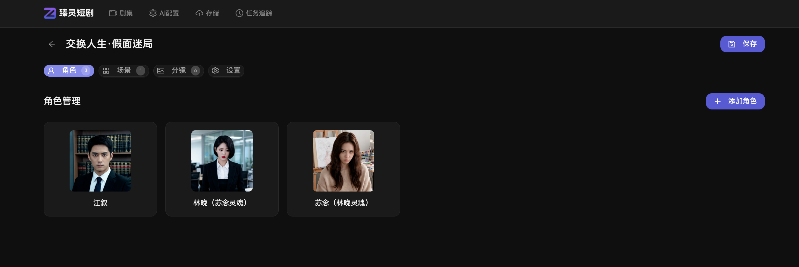

#### 7.2.3 Add New Character

**Step 3**: Click the **「Add Character」** button.

**Step 4**: A form dialog for adding a character appears.

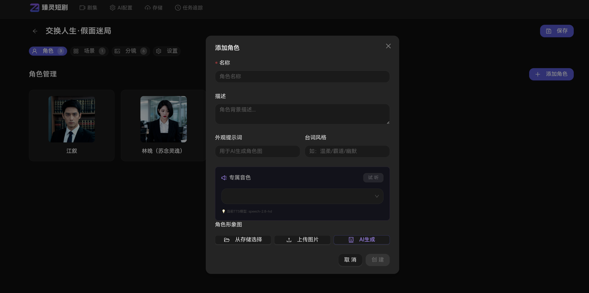

#### 7.2.5 Fill Character Information


| Field                 | Description                                    | Example                              |
| --------------------- | ---------------------------------------------- | ------------------------------------ |
| **Name**              | Character name/code                            | Zhang Wei, Li Ting                   |
| **Description**       | Character background description               | 28-year-old urban female, executive  |
| **Appearance Prompt** | Description for AI to generate character image | Can fill manually or extract with AI |
| **Dialogue Style**    | Character's speaking style                     | Gentle/Tyrant/Humorous               |
| **Exclusive Voice**   | TTS voice used for character                   | Select from voice list               |
| **Character Image**   | Character's appearance image                   | AI generate or upload                |

#### 7.2.6 Select Exclusive Voice

In the "Exclusive Voice" dropdown menu, there are **60+ voices** available.

**Voice Category List**:

**I. Standard Voices (Mandarin Chinese)**


| Voice ID             | Label Display              | Applicable Character | Example Scenario                      |
| -------------------- | -------------------------- | -------------------- | ------------------------------------- |
| `male-qn-qingse`     | 🎙️ Youthful Male Voice   | Young male character | Youngster, student, intern            |
| `male-qn-jingying`   | 🎙️ Elite Male Voice      | Business male        | Manager, elite, businessman           |
| `male-qn-badao`      | 🎙️ Dominant Male Voice   | Dominant male        | CEO, young master, dominant male lead |
| `male-qn-daxuesheng` | 🎙️ College Student Voice | Young male           | College student, campus male lead     |
| `female-shaonv`      | 🎙️ Girl Voice            | Young female         | Female lead, sister, loli             |
| `female-yujie`       | 🎙️ Mature Lady Voice     | Mature female        | Mature lady, female boss, queen       |
| `female-chengshu`    | 🎙️ Mature Woman Voice    | Adult female         | Mother, sister, mature woman          |
| `female-tianmei`     | 🎙️ Sweet Female Voice    | Cute female          | Sweet female lead, girl next door     |

**II. Beta Premium Voices**


| Voice ID                     | Label Display           | Applicable Character | Description                  |
| ---------------------------- | ----------------------- | -------------------- | ---------------------------- |
| `male-qn-qingse-jingpin`     | ⭐ Youthful Male-Beta   | 青涩感年轻男性       | More delicate than standard  |
| `male-qn-jingying-jingpin`   | ⭐ Elite Male-Beta      | 专业精英男性         | More professional elite feel |
| `male-qn-badao-jingpin`      | ⭐ Dominant Male-Beta   | 强势霸道男性         | Stronger dominant feel       |
| `male-qn-daxuesheng-jingpin` | ⭐ College Student-Beta | 校园男生             | Stronger campus feel         |
| `female-shaonv-jingpin`      | ⭐ Girl-Beta            | 清纯少女             | More delicate girl feel      |
| `female-yujie-jingpin`       | ⭐ Mature Lady-Beta     | 成熟御姐             | More mature lady feel        |
| `female-chengshu-jingpin`    | ⭐ Mature Woman-Beta    | 沉稳女性             | More composed female voice   |
| `female-tianmei-jingpin`     | ⭐ Sweet Female-Beta    | 甜美女孩             | Sweeter voice                |

**III. Special Character Voices**


| Voice ID             | Label Display            | Applicable Character  | Description                          |
| -------------------- | ------------------------ | --------------------- | ------------------------------------ |
| `clever_boy`         | 🧒 Smart Boy             | Smart little boy      | Wise child character                 |
| `cute_boy`           | 🧒 Cute Boy              | Cute little boy       | Moe child character                  |
| `lovely_girl`        | 👧 Lovely Girl           | Cute little girl      | Moe little girl                      |
| `cartoon_pig`        | 🐷 Cartoon Pig Xiaoqi    | Cartoon character     | Animation/game character             |
| `bingjiao_didi`      | 😈 Yandere Brother       | Yandere type male     | Obsessive, yandere brother           |
| `junlang_nanyou`     | 👦 Handsome Boyfriend    | Handsome boyfriend    | Idol drama male lead                 |
| `chunzhen_xuedi`     | 🎒 Innocent Junior       | Naive junior          | Campus naive male                    |
| `lengdan_xiongzhang` | 🧊 Cold Senior           | Cold senior           | Ice mountain senior                  |
| `badao_shaoye`       | 🎩 Dominant Young Master | Rich young master     | Rich second generation, young master |
| `tianxin_xiaoling`   | 🍬 Sweet Xiao Ling       | Sweet girl            | Sweet-hearted girl                   |
| `qiaopi_mengmei`     | 😜 Playful Girl          | Playful girl          | Lively and playful female lead       |
| `wumei_yujie`        | 💋 Seductive Lady        | Seductive mature lady | Sexy mature lady                     |
| `diadia_xuemei`      | 🎀 Sweet Junior          | Spoiled junior        | Clingy and spoiled type              |
| `danya_xuejie`       | 📚 Elegant Senior        | Literary senior       | Temperamentally artistic senior      |

**IV. Professional/Special Voices**


| Voice ID                                    | Label Display                   | Applicable Scene           | Description                  |
| ------------------------------------------- | ------------------------------- | -------------------------- | ---------------------------- |
| `Chinese (Mandarin)_Reliable_Executive`     | 💼 Steady Executive             | Mature male manager        | CEO, leader                  |
| `Chinese (Mandarin)_News_Anchor`            | 📺 News Female Voice            | News broadcast             | News narrator                |
| `Chinese (Mandarin)_Mature_Woman`           | 💅 Tsundere Lady                | Tsundere female            | Tsundere female lead         |
| `Chinese (Mandarin)_Unrestrained_Young_Man` | 🏍️ Uninhibited Youth          | Rebellious youth           | Motorcycle rider, rock youth |
| `Arrogant_Miss`                             | 😤 Arrogant Miss                | Arrogant young lady        | Rich daughter                |
| `Robot_Armor`                               | 🤖 Mech Armor                   | Robot                      | Sci-fi character             |
| `Chinese (Mandarin)_Kind-hearted_Antie`     | 👵 Kind-hearted Aunt            | Middle-aged/elderly female | Neighbor aunt                |
| `Chinese (Mandarin)_HK_Flight_Attendant`    | ✈️ HK Accent Flight Attendant | Hong Kong Mandarin         | Flight attendant character   |
| `Chinese (Mandarin)_Humorous_Elder`         | 😂 Funny Grandpa                | Funny elderly male         | Comedy character             |
| `Chinese (Mandarin)_Gentleman`              | 🎩 Gentle Voice                 | Gentle male                | Warm man                     |
| `Chinese (Mandarin)_Warm_Bestie`            | 👭 Warm Bestie                  | Female best friend         | BFF                          |
| `Chinese (Mandarin)_Male_Announcer`         | 🎤 Announcer Male               | Broadcast                  | Sports commentary            |
| `Chinese (Mandarin)_Sweet_Lady`             | 🌸 Sweet Female Voice           | Sweet female               | Sweet female lead            |
| `Chinese (Mandarin)_Southern_Young_Man`     | 🌾 Southern Lad                 | Southern-accented male     | Southern male character      |
| `Chinese (Mandarin)_Wise_Women`             | 📖 Experienced Sister           | Female with stories        | Big sister                   |
| `Chinese (Mandarin)_Gentle_Youth`           | 🍃 Gentle Youth                 | Gentle youth               | Warm male lead               |
| `Chinese (Mandarin)_Warm_Girl`              | ☀️ Warm Girl                  | Warm girl                  | Healing female lead          |
| `Chinese (Mandarin)_Kind-hearted_Elder`     | 👵 Sixty-year-old Grandma       | Elderly female             | Grandma character            |
| `Chinese (Mandarin)_Cute_Spirit`            | 🦄 Cute Beast                   | Cute beast voice           | Cartoon animal               |
| `Chinese (Mandarin)_Radio_Host`             | 📻 Radio Host Male              | Radio host                 | Broadcast host               |
| `Chinese (Mandarin)_Lyrical_Voice`          | 🎵 Lyrical Male Voice           | Lyrical/singing            | Singer character             |
| `Chinese (Mandarin)_Straightforward_Boy`    | 🗣️ Straightforward Boy        | Frank boy                  | Frank boy                    |
| `Chinese (Mandarin)_Sincere_Adult`          | 🙏 Sincere Youth                | Sincere male               | Sincere male lead            |
| `Chinese (Mandarin)_Gentle_Senior`          | 🌙 Gentle Senior                | Gentle senior              | College senior               |
| `Chinese (Mandarin)_Stubborn_Friend`        | 😤 Stubborn Childhood Friend    | Tsundere childhood friend  | Childhood friend             |
| `Chinese (Mandarin)_Crisp_Girl`             | ✨ Crisp Girl                   | Clear-voiced girl          | Innocent girl                |
| `Chinese (Mandarin)_Pure-hearted_Boy`       | 💙 Pure-hearted Boy             | Clear boy voice            | Neighbor boy                 |
| `Chinese (Mandarin)_Soft_Girl`              | 🌸 Soft Girl                    | Soft female voice          | Soft female lead             |

**V. Chinese (Cantonese)**


| Voice ID                         | Label Display                           | Applicable Scene        | Description       |
| -------------------------------- | --------------------------------------- | ----------------------- | ----------------- |
| `Cantonese_ProfessionalHost（F)` | 🇭🇰 Cantonese-Professional Female Host | Cantonese female host   | Hong Kong program |
| `Cantonese_GentleLady`           | 🇭🇰 Cantonese-Gentle Female            | Gentle Cantonese female | Gentle female     |
| `Cantonese_ProfessionalHost（M)` | 🇭🇰 Cantonese-Professional Male Host   | Cantonese male host     | Hong Kong program |
| `Cantonese_PlayfulMan`           | 🇭🇰 Cantonese-Playful Male             | Playful Cantonese male  | Playful male      |
| `Cantonese_CuteGirl`             | 🇭🇰 Cantonese-Cute Girl                | Cute Cantonese girl     | Little girl       |
| `Cantonese_KindWoman`            | 🇭🇰 Cantonese-Kind Woman               | Kind Cantonese female   | Kind female       |

> **Voice Selection Suggestions**:
>
> - Prioritize voices that match character personality
> - Beta premium voices are more delicate than standard voices but may consume more resources
> - Special character voices are suitable for characters with specific personas
> - Cantonese voices are suitable for characters needing local flavor

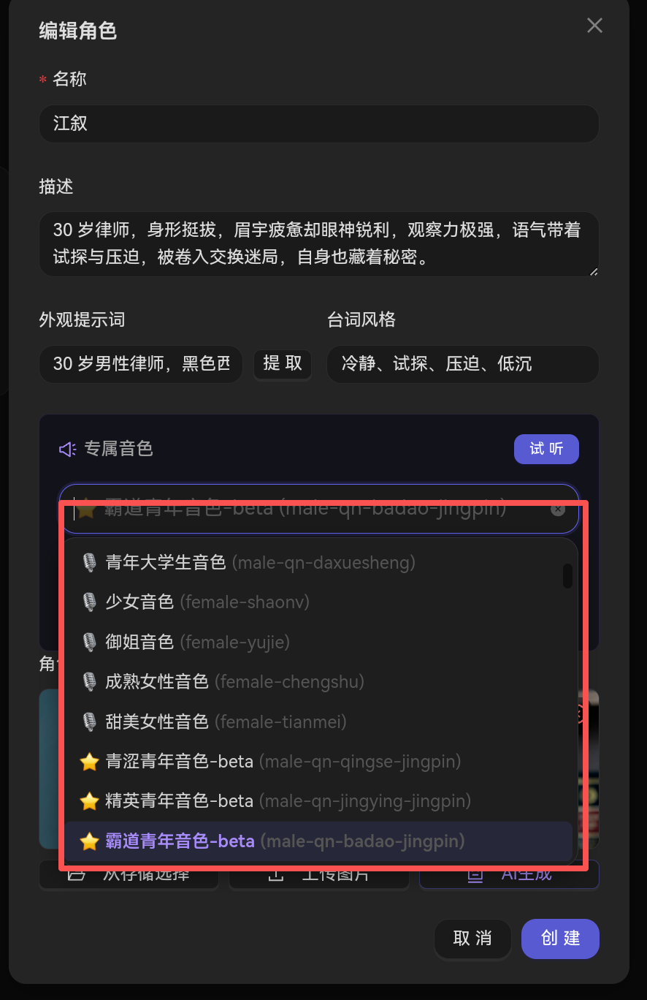

#### 7.2.7 Preview Voice

1. Select a voice
2. Click the **「Preview」** button
3. Wait for preview audio generation (~10-30 seconds)
4. Play preview in the preview area

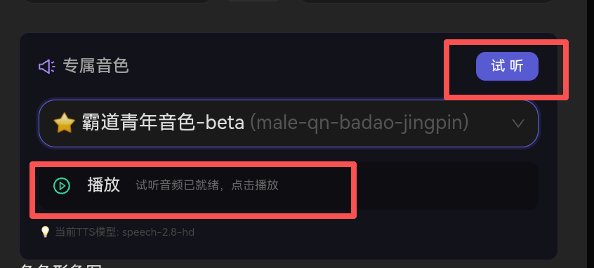

#### 7.2.8 Generate/Upload Character Image

**Method 1: AI Auto Generate**

1. Fill in "Appearance Prompt" (describe character appearance)
2. Click the **「AI Generate」** button
3. Wait for generation to complete (usually 10-30 seconds)

**Method 2: Select from Library**

1. Click the **「Select from Storage」** button
2. In the popup window, select an uploaded image
3. Confirm selection

**Method 3: Upload Local Image**

1. Click the **「Upload Image」** button
2. Select image file from local
3. Image automatically fills in

**Method 4: Extract Appearance Description from Existing Image**

If you already have a character image:

1. First upload the character image
2. Click the **「Extract」** button (located to the right of the image)
3. System automatically analyzes the image and fills in the "Appearance Prompt"

#### 7.2.9 Save Character

**Step 5**: After confirming character information is complete, click the **「Create」** button.

---

### 7.3 Scene Management

#### 7.3.1 Operation Path

```
Drama Details Page → Click "Scenes" Tab → Add Scene → Fill Info → Save
```

#### 7.3.2 Enter Scene Management

**Step 1**: On the Drama Details page, click the **「Scenes」** tab.

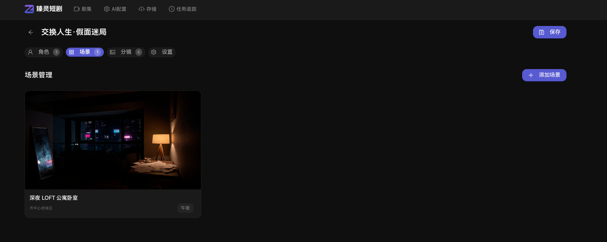

#### 7.3.3 Add New Scene

**Step 3**: Click the **「Add Scene」** button.

A form dialog for adding a scene appears.

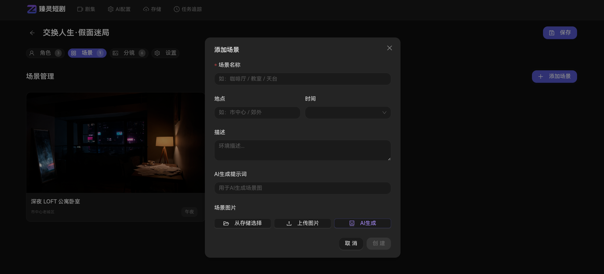

#### 7.3.4 Fill Scene Information


| Field           | Description                  | Example                                                               |
| --------------- | ---------------------------- | --------------------------------------------------------------------- |
| **Scene Name**  | Scene name/code              | Warm Living Room, Late Night Rooftop                                  |
| **Location**    | Scene location               | City Center, Suburbs, School                                          |
| **Time**        | Time period of the scene     | Day, Night, Morning, etc.                                             |
| **Description** | Environment details          | Modern minimalist style, floor-to-ceiling window with city night view |
| **AI Prompt**   | Used for AI scene generation | Fill manually or leave empty for AI auto-generation                   |
| **Scene Image** | Scene reference image        | AI generate or upload                                                 |

#### 7.3.5 Time Period Options


| Time Period | Description               | Example Scenes              |
| ----------- | ------------------------- | --------------------------- |
| Day         | Daytime scene, sunny      | Living room, office, street |
| Night       | Night scene, lit          | Nightclub, rooftop, street  |
| Morning     | Morning scene, dawn light | Park, lakeside, bedroom     |
| Dusk        | Evening scene, sunset     | Rooftop, seaside, street    |
| Dawn        | Just after sunrise        | Street, park, countryside   |
| Midnight    | Around midnight           | Office, hospital, street    |

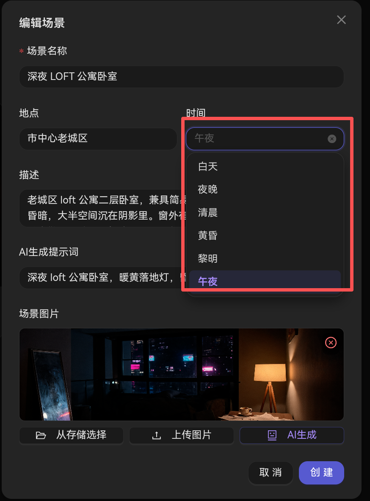

#### 7.3.6 Generate/Upload Scene Image

**Method 1: AI Auto Generate**

1. Fill in "AI Prompt" (describe scene environment)
2. Click the **「AI Generate」** button
3. Wait for generation to complete

**Method 2: Select from Library**

1. Click the **「Select from Storage」** button
2. Select an uploaded image

**Method 3: Upload Local Image**

1. Click the **「Upload Image」** button

#### 7.3.7 Save Scene

**Step 5**: After confirming information is complete, click the **「Create」** button.

---

### 7.4 Storyboard Design

#### 7.4.1 Operation Path

```
Drama Details Page → Click "Storyboard" Tab → AI Analyze Script or Manually Add Storyboard
```

#### 7.4.2 Enter Storyboard List

**Step 1**: On the Drama Details page, click the **「Storyboard」** tab.

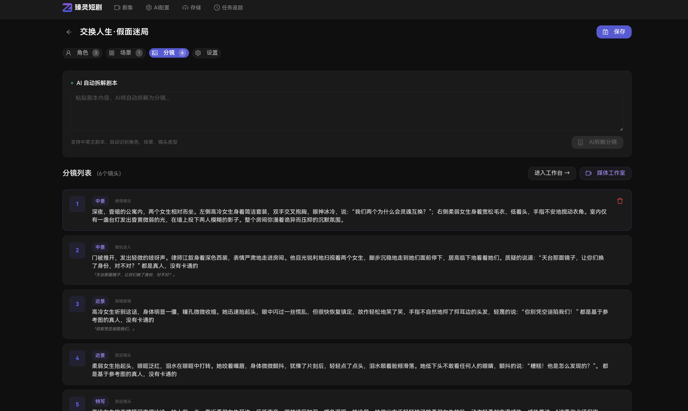

#### 7.4.3 Method 1: AI Auto Analyze Script

If you have a complete script, you can use the AI auto-analyze function.

**Step 3**: **Paste the complete script content** in the text box above the storyboard list.

> **Script Format Suggestions**:
>
> - Plain text format
> - Include scene descriptions and character dialogue
> - Recommended to mark character name before each dialogue

> **Example Script Format**:
>
> ```
> 【Act 1 Living Room】
> Zhang Wei: (Walking into living room) I'm so tired today.
> Li Ting: (Handing over coffee) Hard work, have some coffee.
>
> 【Act 2 Office】
> Zhang Wei: (Sitting at desk) This project must be completed soon.
> Colleague: No problem, I'll help you.
> ```

**Step 4**: Click the **「AI Analyze Storyboard」** button.

**Step 5**: AI analyzes the script and automatically generates storyboards. Wait for generation to complete (usually 30-60 seconds).

**Step 6**: After analysis is complete, all storyboards are automatically filled in the storyboard list.


#### 7.4.4 Method 2: Manually Add/Edit Storyboard

**Step 3**: In the storyboard list, click the storyboard card you want to edit.

**Step 4**: A storyboard edit form appears.

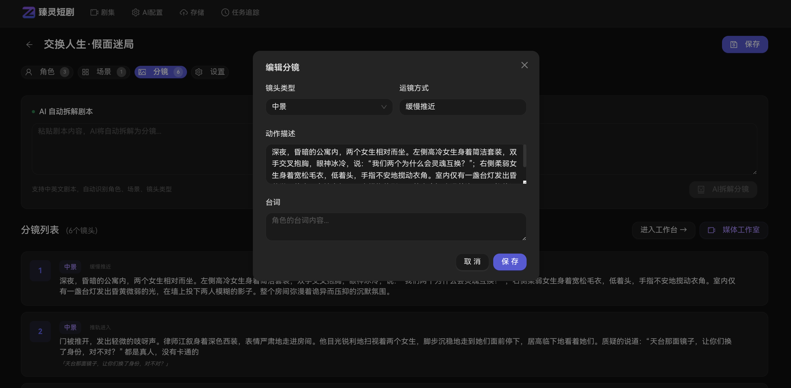

#### 7.4.5 Fill Storyboard Information


| Field                  | Description                 | Example                                                   |
| ---------------------- | --------------------------- | --------------------------------------------------------- |
| **Shot Type**          | Shot size                   | Wide, Medium, Close-up, Extreme Close-up                  |
| **Camera Movement**    | Camera movement method      | Push in/Pull out/Fixed                                    |
| **Action Description** | Action and画面 of this shot | Character slowly turns around, background is sunset beach |
| **Dialogue**           | Character dialogue          | Zhang Wei: The weather is really nice today!              |

**Shot Type Details**:


| Shot Type            | Description                             | Applicable Scenes                                |
| -------------------- | --------------------------------------- | ------------------------------------------------ |
| **Wide**             | Shows complete scene and all characters | Opening, group scenes, environment establishment |
| **Medium**           | Shows characters from waist up          | Dialogues, action scenes                         |
| **Close-up**         | Shows characters from chest up          | Dialogue close-ups, emotional expression         |
| **Extreme Close-up** | Focuses on face or object               | Emphasis on expression, details                  |

**Camera Movement Notes**:


| Movement       | Description                          |
| -------------- | ------------------------------------ |
| Push in        | Camera moves forward, image enlarges |
| Pull out       | Camera moves back, image shrinks     |
| Fixed          | Camera stays still                   |
| Left/Right Pan | Camera pans left/right               |
| Up/Down        | Camera moves up/down                 |
| Tilt           | Camera tilts left/right              |

#### 7.4.6 Link Characters and Scenes

In the storyboard edit dialog:

**Link Characters**:

- Select from the character dropdown menu (supports multiple selection)
- Characters with character images set will show 📸 icon
- Selected characters automatically bring in character images

**Link Scenes**:

- Select from the scene dropdown menu
- Scenes with scene images set will show 📸 icon
- Selected scenes automatically bring in scene images

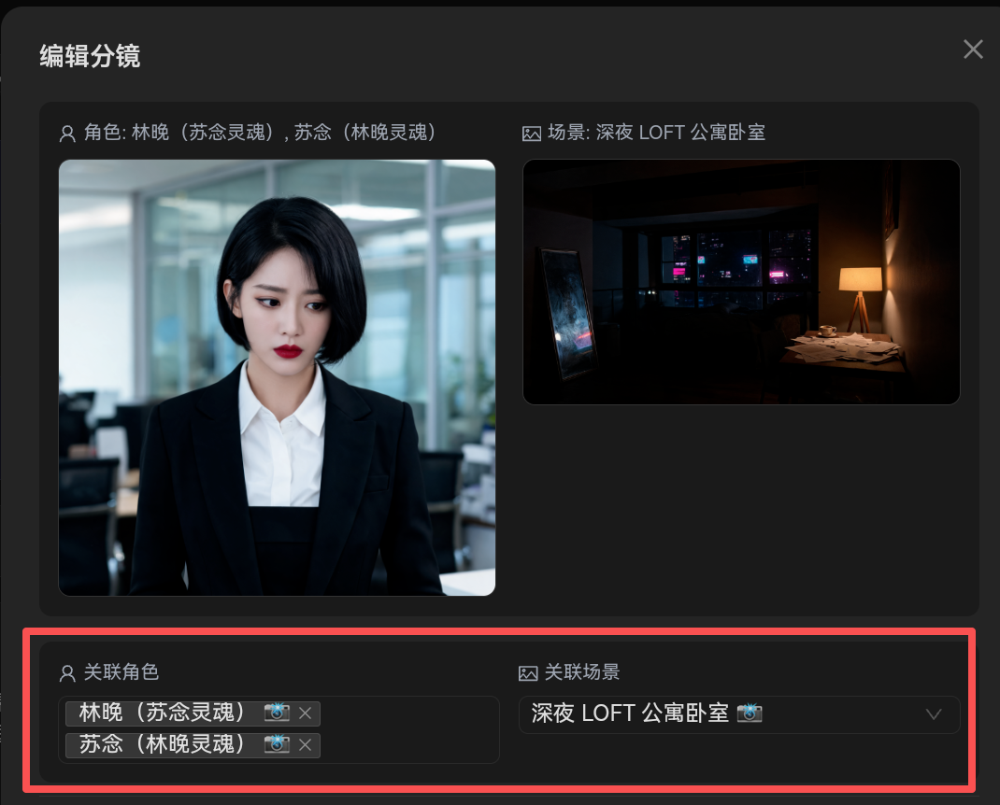

#### 7.4.7 Save Storyboard

**Step 5**: After confirming information is complete, click the **「Save」** button.

---

### 7.5 Workbench (Batch Reference Image Management)

Entry: **Drama Details Page → Enter Workbench**

#### 7.5.1 Workbench Page Layout

The workbench contains the following tabs:


| Tab                   | Description                                                         |
| --------------------- | ------------------------------------------------------------------- |
| **Storyboard Editor** | Storyboard list, reference image management, video generation entry |
| **Character Images**  | Batch manage character image generation                             |
| **Scene Images**      | Batch manage scene image generation                                 |
| **Video Generation**  | Quick video generation                                              |

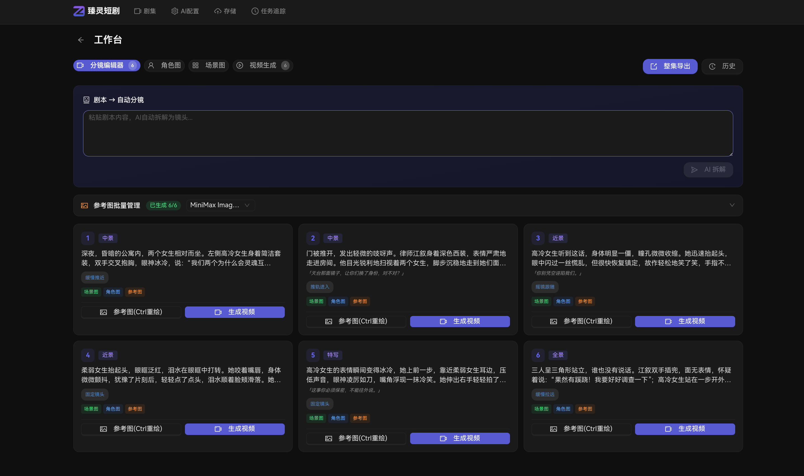

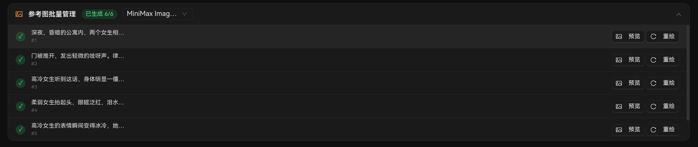

#### 7.5.2 Storyboard Editor Tab

###### 7.5.2.1 Batch Reference Image Management Panel

Above the storyboard list there is a **Reference Image Batch Management** panel showing:


| Information     | Description                                              |
| --------------- | -------------------------------------------------------- |
| Generated Count | Generated reference image count / Total storyboard count |
| Model Selection | Select model for reference image generation              |

**Reference Image Model Options**:


| Model                                 | Description                     |
| ------------------------------------- | ------------------------------- |
| **MiniMax Image-01**                  | MiniMax image generation model  |
| **Seedream 5.0 (Multi-image Fusion)** | Doubao multi-image fusion model |

**Batch Generate Button**:

- Click the **「Generate All」** button to batch generate images for storyboards without reference images
- Shows "X not generated" indicating how many storyboards still need generation

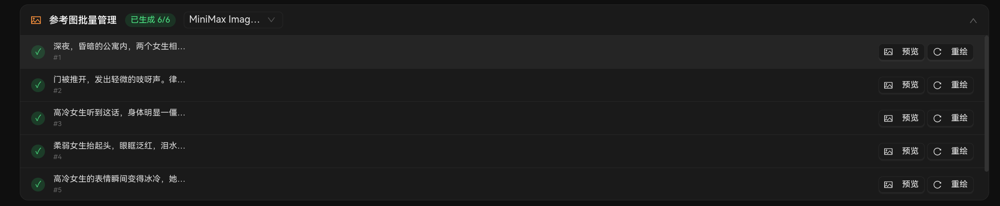

###### 7.5.2.2 Storyboard Card Content

Each storyboard card displays:


| Information        | Description                                                 |
| ------------------ | ----------------------------------------------------------- |
| Shot Number        | Storyboard sequence number                                  |
| Shot Type Label    | Wide/Medium/Close-up/Extreme Close-up                       |
| Action Description | Action and画面 description of this shot                     |
| Dialogue           | Character dialogue (if any)                                 |
| Character Label    | Linked character name                                       |
| Movement Label     | e.g., Push in/Pull out                                      |
| Image Tags         | Scene Image/Character Image/Grid Image/Reference Image tags |

###### 7.5.2.3 Storyboard Card Operations


| Operation                               | Function                                     |
| --------------------------------------- | -------------------------------------------- |
| **Click Card**                          | Open storyboard edit dialog                  |
| **Generate Reference Image**            | Generate reference image for this storyboard |
| **Ctrl+Click Generate Reference Image** | Force regenerate (overwrite existing image)  |
| **Preview**                             | Preview generated reference image            |
| **Redraw**                              | Regenerate reference image                   |
| **Generate Video**                      | Jump to Media Studio video generation page   |

###### 7.5.2.4 Reference Image Status


| Status        | Display       | Description                         |
| ------------- | ------------- | ----------------------------------- |
| Generated     | Green ✓ icon | This storyboard has reference image |
| Not Generated | Gray ○ icon  | Reference image not yet generated   |

#### 7.5.3 Character Images Tab

###### 7.5.3.1 Character Card

Each character card displays:


| Information       | Description                                 |
| ----------------- | ------------------------------------------- |
| Character Image   | Character image (shows placeholder if none) |
| Character Name    | Character name                              |
| Generation Status | AI generation loading animation             |

###### 7.5.3.2 Character Image Operations


| Operation                       | Function                                          |
| ------------------------------- | ------------------------------------------------- |
| **AI Generate Character Image** | Generate character image for this character       |
| Click Generating                | Wait for generation to complete (button disabled) |

> **Prerequisite**: Must first add characters and set appearance prompts in the "Characters" tab.

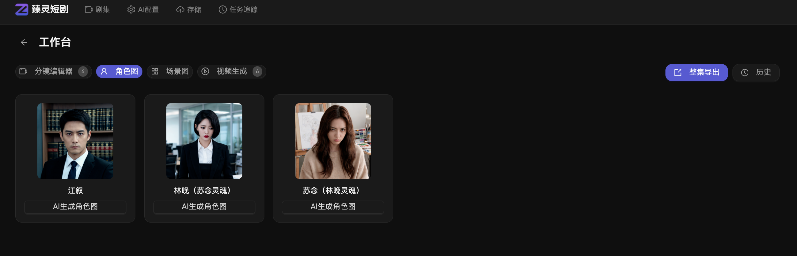

#### 7.5.4 Scene Images Tab

###### 7.5.4.1 Scene Card

Each scene card displays:


| Information       | Description                                        |
| ----------------- | -------------------------------------------------- |
| Scene Image       | Scene background image (shows placeholder if none) |
| Scene Name        | Scene name                                         |
| Generation Status | AI generation loading animation                    |

###### 7.5.4.2 Scene Image Operations


| Operation                   | Function                                 |
| --------------------------- | ---------------------------------------- |
| **AI Generate Scene Image** | Generate background image for this scene |

> **Prerequisite**: Must first add scenes and set AI prompts in the "Scenes" tab.

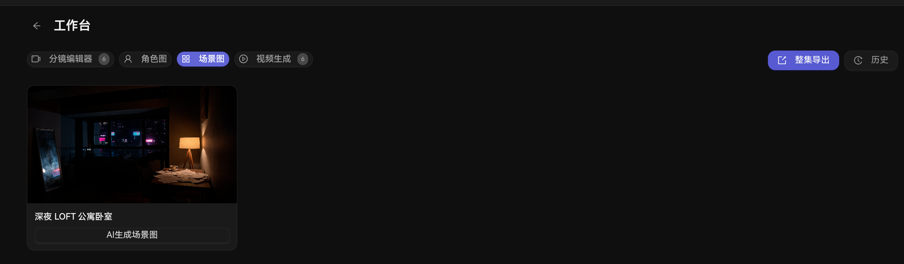

#### 7.5.5 Video Generation Tab

###### 7.5.5.1 Quick Video Generation

**Step 1**: In the "Reference Image URL" input field, paste the image address.

> **Image Sources**:
>
> - Reference image URL of storyboard
> - Grid image URL
> - Character image URL
> - Scene image URL

**Step 2**: In the "Video Model" dropdown menu, select an AI model.


| Model                  | Description                    |
| ---------------------- | ------------------------------ |
| **MiniMax Hailuo 2.3** | MiniMax video generation model |
| **MiniMax Video-01**   | MiniMax video model 01         |

**Step 3**: Click the **「Generate Video」** button.

###### 7.5.5.2 Video Records

The generation record list displays:


| Information   | Description                      |
| ------------- | -------------------------------- |
| Video Preview | Video cover image or play button |
| Model Name    | AI model used                    |
| Status Label  | Completed / Processing / Failed  |
| Episode       | Episode it belongs to            |
| Duration      | Video duration                   |

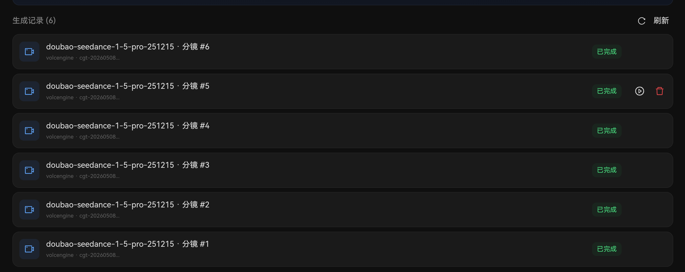

**Video Preview Operations**:

- Click video area: Play/pause video
- When video plays, progress bar and playback controls are shown

---

### 7.6 TTS Voiceover

Entry: **Media Studio → Voiceover Tab**

#### 7.6.1 Enter Voiceover Page

**Step 1**: On the Drama Details page, click **「Media Studio」**.

**Step 2**: In the Media Studio, the "Voiceover" tab is displayed by default.

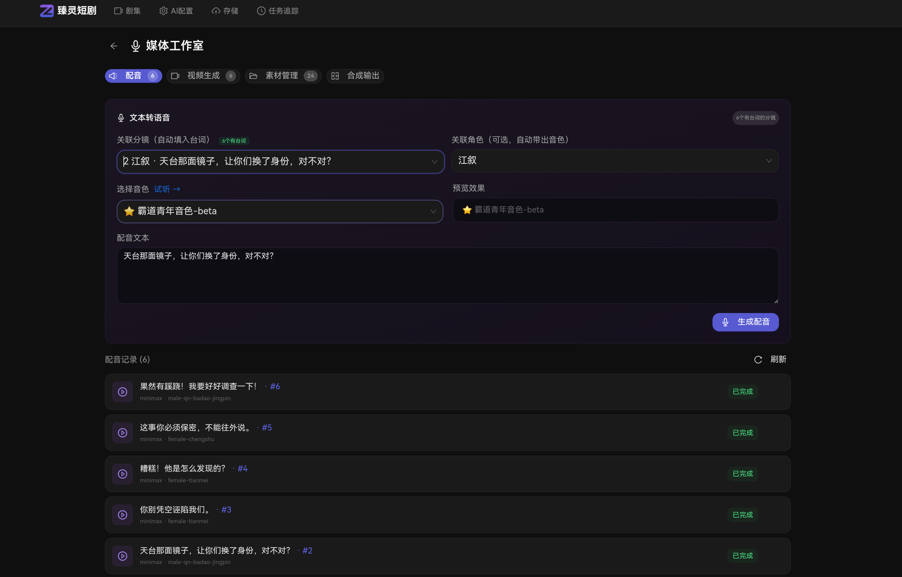

#### 7.6.2 Voiceover Page Layout


| Area               | Description                             |
| ------------------ | --------------------------------------- |
| Related Storyboard | Dropdown to select storyboard to voice  |
| Related Character  | Dropdown to select character (optional) |
| Voice Selection    | Dropdown to select voice                |
| Preview Button     | Preview currently selected voice        |
| Voice Text         | Multi-line text box to input dialogue   |
| Generate Button    | Submit voice generation task            |
| Voice Record List  | Shows generated voice records           |

#### 7.6.3 Select Target Storyboard

**Step 3**: In the "Related Storyboard" dropdown menu, select the storyboard to voice.

> **Auto-fill Function**:
>
> - After selecting a storyboard, that storyboard's **dialogue automatically fills** the text box
> - The storyboard's **linked character automatically brings out**
> - **Automatically selects matching voice** based on character info (if set)

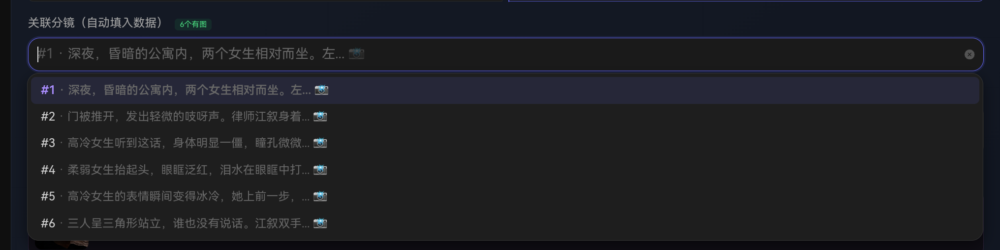

#### 7.6.4 Select Voice

**Step 4**: From the "Select Voice" dropdown menu, select an appropriate character voice.

> **Voice List**: 60+ voices, see "7.2.6 Select Exclusive Voice" section for details.

#### 7.6.5 Preview Voice

1. Select a voice
2. Click the **「Preview →」** link
3. Wait for preview audio generation (~10-30 seconds)
4. Play preview in the preview area

#### 7.6.6 Fill/Modify Voice Text

**Step 5**: In the "Voice Text" text box, confirm or modify the dialogue content.

> **Tips**:
>
> - If a storyboard is selected, dialogue auto-fills
> - You can manually modify dialogue content
> - It is recommended to keep each voice segment under 50 characters for better results

#### 7.6.7 Generate Voiceover

**Step 6**: After confirming information is correct, click the **「Generate Voiceover」** button.

#### 7.6.8 Voice Record List


| Column           | Description                                  |
| ---------------- | -------------------------------------------- |
| Play Button      | Click to preview voice (purple play icon)    |
| Dialogue Preview | Shows dialogue content (first 50 characters) |
| Storyboard #     | Linked storyboard number                     |
| Voice Info       | Voice and provider used                      |
| Duration         | Voice audio duration (seconds)               |
| Status           | Completed / Processing / Failed              |
| Operation        | Delete this voice record                     |

---

### 7.7 Video Generation

Entry: **Media Studio → Video Generation Tab**

#### 7.7.1 Enter Video Generation Page

**Step 1**: In the Media Studio, click the **「Video Generation」** tab.

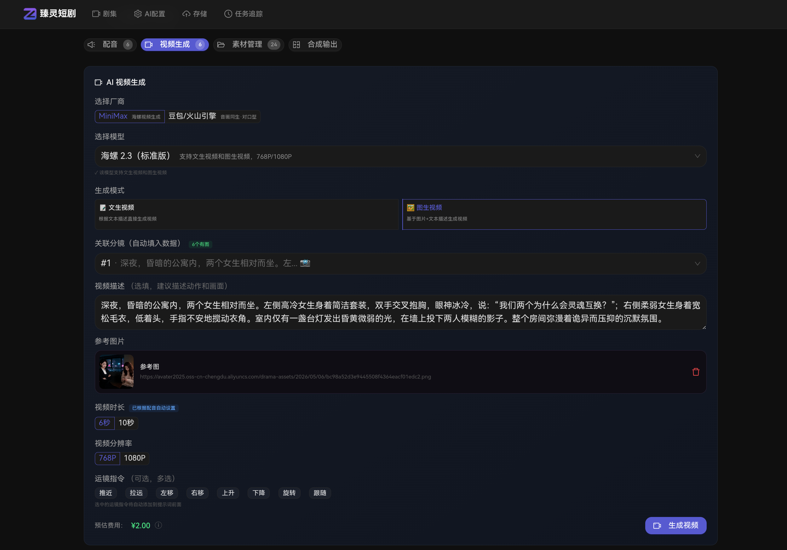

#### 7.7.2 Video Generation Page Layout


| Area                 | Description                                                                |
| -------------------- | -------------------------------------------------------------------------- |
| Vendor Selection     | Radio button to select AI vendor                                           |
| Model Selection      | Dropdown to select specific AI model                                       |
| Generation Mode      | Radio button to select generation mode                                     |
| Related Storyboard   | Dropdown to select storyboard (auto-fill data)                             |
| Scene Description    | Multi-line text box to input video description                             |
| Reference Image      | Image upload for image-to-video/first-last-frame/character-reference modes |
| Duration Selection   | 6s/10s or 4-12s slider                                                     |
| Resolution Selection | Radio button to select video quality                                       |
| Camera Movement      | Multi-select tags to select camera movement                                |
| Estimated Cost       | Shows cost of this generation                                              |
| Generate Button      | Submit video generation task                                               |

#### 7.7.3 Select AI Vendor

**Step 3**: In "Select Vendor", choose an AI service provider.


| Vendor                | Description                                                     |
| --------------------- | --------------------------------------------------------------- |
| **MiniMax**           | Hailuo video generation, supports text-to-video, image-to-video |
| **Doubao/Volcengine** | Audio-video sync, supports lip-sync effect                      |


#### 7.7.4 Select Model

**Step 4**: In "Select Model" dropdown, select the specific AI model.

##### 7.7.4.1 MiniMax Model Options


| Model                      | Supported Modes                                    | Supported Resolutions | Supported Duration | Price Reference                                    |
| -------------------------- | -------------------------------------------------- | --------------------- | ------------------ | -------------------------------------------------- |
| **Hailuo 2.3 (Standard)**  | Text-to-Video, Image-to-Video                      | 768P, 1080P           | 6s / 10s           | 6s-768P: ¥2.00<br>6s-1080P: ¥3.50<br>10s: ¥4.00 |
| **Hailuo 2.3-Fast (Fast)** | Image-to-Video only                                | 768P, 1080P           | 6s / 10s           | 6s-768P: ¥1.35<br>6s-1080P: ¥2.31                |
| **Hailuo 02 (Multi-mode)** | Text-to-Video, Image-to-Video,**First-Last Frame** | 512P, 768P, 1080P     | 6s / 10s           | 6s-512P: ¥0.60 (lowest price)                     |
| **S2V-01 (Character Ref)** | Character Reference only                           | 720P only             | 6s only            | ¥2.00 (fixed)                                     |

##### 7.7.4.2 Doubao/Volcengine Model Options


| Model                              | Supported Modes                  | Supported Resolutions | Supported Duration        | Features                           |
| ---------------------------------- | -------------------------------- | --------------------- | ------------------------- | ---------------------------------- |
| **Seedance 1.5 Pro (Audio-Video)** | Image-to-Video, First-Last Frame | 480P, 720P, 1080P     | 4-12s (slider adjustment) | Audio-video sync, lip-sync support |

> **Doubao Seedance 1.5 Pro Special Notes**:
>
> - Doubao model supports **audio-video sync generation** (video and audio generated simultaneously), which is the core difference from MiniMax
> - Generated videos come with native audio tracks, no need for subsequent voice synthesis
> - Supports multi-language and dialect lip-sync (Mandarin, Shaanxi, Sichuan, English, etc.)

##### 7.7.4.3 Doubao Seedance 1.5 Pro Details

Doubao Seedance 1.5 Pro (Model ID: `doubao-seedance-1-5-pro-251215`) is a professional video generation model provided by Volcengine. Its core feature is **audio-video sync generation** — audio and video are generated simultaneously in one generation task, ensuring perfect lip-sync with voice.

---

###### Supported Task Types


| Task Type                | Description                                                  | Applicable Scenes                                         |
| ------------------------ | ------------------------------------------------------------ | --------------------------------------------------------- |
| **Image-to-Audio-Video** | Generate video with audio based on image + voice description | Generate talking video when having character/scene images |
| **Image-to-Video**       | Generate silent video based on image + text description      | Show action but don't need character voice                |
| **Text-to-Audio-Video**  | Generate video with audio based on text description only     | Generate talking video without reference images           |
| **Text-to-Video**        | Generate silent video based on text description only         | Generate pure visual video without reference images       |

> **Actually Available**: The current platform interface mainly opens "Image-to-Video" and "First-Last Frame" modes. "Image-to-Audio-Video" and "Text-to-Audio-Video" need to be implemented through advanced features like storyline flow.

---

###### Resolution and Duration Parameters


| Parameter      | Options                                      | Description                             |
| -------------- | -------------------------------------------- | --------------------------------------- |
| **Resolution** | 480P (SD)                                    | Lowest cost, suitable for quick preview |
|                | 720P (HD)                                    | Medium cost, recommended for daily use  |
|                | 1080P (Full HD)                              | Highest cost, suitable for final output |
| **Duration**   | 4s / 6s / 8s / 10s / 12s (slider adjustment) | Longer duration means higher cost       |

> **Selection Suggestions**:
>
> - **Quick Preview**: 480P + 4s = Lowest cost, suitable for checking effect before formal production
> - **Daily Production**: 720P + 6-8s = Recommended configuration, best cost-effectiveness
> - **Formal Output**: 1080P + 10-12s = Highest quality, suitable for final delivery

---

###### Price Description

Doubao Seedance is charged by **Tokens**, not by second:


| Video Type          | Price                 | Description                               |
| ------------------- | --------------------- | ----------------------------------------- |
| **With Audio**      | ¥16 / million Tokens | Video with audio (audio-video sync)       |
| **Silent**          | ¥8 / million Tokens  | Pure visual video (no audio track)        |
| **Batch Inference** | Lower discount price  | Suitable for large-scale production tasks |

> **Difference from MiniMax**:
>
> - MiniMax charges by "second", price is fixed
> - Doubao charges by "Tokens", actual cost depends on prompt complexity (longer prompts = more Tokens)
> - Batch inference can get lower unit price, suitable for professional production teams

---

###### Multi-language and Dialect Support

Doubao Seedance 1.5 Pro supports **multi-language lip-sync**, automatically matching lip shapes based on dialogue:


| Language/Dialect | Description       | Applicable Scenes                         |
| ---------------- | ----------------- | ----------------------------------------- |
| **Mandarin**     | Standard Chinese  | Most domestic short dramas                |
| **Shaanxi**      | Shaanxi dialect   | Plays with regional features              |
| **Sichuan**      | Sichuan dialect   | Southwest style short dramas              |
| **English**      | English dialogue  | International content, overseas scenarios |
| **Japanese**     | Japanese dialogue | Anime-style content                       |
| **Korean**       | Korean dialogue   | Korean drama style content                |
| **Cantonese**    | Cantonese         | Hong Kong style content                   |

> **Lip-sync Principle**: The system automatically adjusts lip shape based on the language in the audio to match the voice, presenting natural lip-sync effect.

---

###### Scene Description (Prompt) Writing Tips

The video quality of Doubao Seedance largely depends on the quality of the Prompt (scene description). Here are detailed tips:

####### Prompt Basic Structure

A complete Prompt should contain the following elements:

```
[Scene Environment] + [Character Appearance] + [Character Action] + [Camera Movement] + [Atmosphere/Lighting] + [Sound Description]
```

###### Detailed Description of Each Element

**1. Scene Environment (Required)**

Describe the location and background of the story:


| Example                                                        | Description                             |
| -------------------------------------------------------------- | --------------------------------------- |
| `Modern office, floor-to-ceiling window with city night view`  | Specific location + environment details |
| `Old teahouse, wooden tables and chairs, calligraphy on walls` | Traditional style + furnishings         |
| `Sea cliff, lighthouse in distance, waves crashing on rocks`   | Natural landscape + dynamic elements    |

**2. Character Appearance (Required)**

Describe the visual characteristics of characters in the scene:


| Example                                                       | Description                    |
| ------------------------------------------------------------- | ------------------------------ |
| `Female, around 30, black long hair, business suit`           | Basic features                 |
| `Male, early 40s, short hair, gray suit, dark leather shoes`  | More detailed outfit           |
| `Young girl, 20 years old, light makeup, red dress, ponytail` | Detailed appearance + clothing |

**3. Character Action (Required)**

Describe the actions and expressions of characters in the scene:


| Example                                                                 | Description           |
| ----------------------------------------------------------------------- | --------------------- |
| `Woman slowly stands up, surprised expression, slightly furrowed brow`  | Action + expression   |
| `Man leans by window, arms crossed, gaze looking into distance`         | Pose + gaze direction |
| `Two people look at each other, woman gently nods, faint smile on lips` | Interactive action    |

**4. Camera Movement (Optional)**

Describe how the camera moves (camera movement instructions):


| Example                                                                           | Description |
| --------------------------------------------------------------------------------- | ----------- |
| `Camera slowly pushes forward, focusing on character's facial expression changes` | Push in     |
| `Camera slowly pulls out, showing the entire scene's spatial sense`               | Pull out    |
| `Camera slightly pans right, following character's movement`                      | Pan         |

**5. Atmosphere/Lighting (Optional)**

Describe the lighting and atmosphere of the scene:


| Example                                                      | Description                    |
| ------------------------------------------------------------ | ------------------------------ |
| `Warm sunset tones, sunlight slanting through window`        | Time + lighting direction      |
| `Cold moonlight, only warm light from desk lamp in room`     | Moonlight + point light source |
| `Neon lights flickering, creating nighttime city atmosphere` | Special lighting effect        |

**6. Sound Description (Important)**

For "videos with audio", the Prompt should include sound descriptions to help the model understand audio features:


| Sound Type            | Example                                                                   |
| --------------------- | ------------------------------------------------------------------------- |
| **Voice Description** | `Female voice, gentle but firm, moderate pace, slightly emotional`        |
| **Tone Description**  | `Surprised tone, slightly fast pace, rising intonation at end`            |
| **Ambient Sound**     | `Faint coffee shop background chatter, occasional piano music audible`    |
| **Sea Sound**         | `Sound of waves hitting shore, sea breeze, seagulls crying`               |
| **Office Sound**      | `Typewriter keystrokes, phone ringing, paper rustling`                    |
| **Footstep Sound**    | `Crisp sound of high heels on floor, footsteps approaching from distance` |

> **Important**: Sound descriptions help the model understand audio content, thereby generating more matching lip shapes. If sound features are not described, the generated lip shapes may not match the actual audio.

####### Prompt Complete Examples

**Example 1: Video with Audio (Female character speaking)**

```
Modern living room scene, warm yellow lighting, floor-to-ceiling window with city night view.
Female, around 30, black long hair, wearing beige knit sweater, sitting on sofa.
She slightly turns her body, looking toward camera direction, lips gently opening.
Camera slowly pushes in, focusing on facial expression.
Faint piano music in background.
Female voice, gentle but slightly melancholic, slow pace.
Sound of waves hitting the shore.
```

**Example 2: Silent Video (Scene display)**

```
Ancient inn lobby, wooden beams, red lanterns hanging on both sides.
A martial artist standing at the counter, wearing dark martial attire, sword at waist.
He holds a wine cup in right hand, eyes scanning surroundings alertly.
Camera slowly pulls out, showing the entire inn.
Candlelight flickering, creating mysterious atmosphere.
```

**Example 3: First-Last Frame Transition (Two-person dialogue)**

```
【First Frame】Corner of a coffee shop, woman sitting by window, sunlight slanting on her profile.
【Last Frame】Woman standing up, smiling, hands gently taking document from man across from her.
Transition: Woman slowly rises from sitting position, hand movements naturally connecting.
Camera stays fixed, focus shifts from woman's profile to hands.
```

---

###### Parameter Settings Suggestions


| Scenario                         | Recommended Configuration                    | Reason                                                                            |
| -------------------------------- | -------------------------------------------- | --------------------------------------------------------------------------------- |
| **Quick Preview / Test**         | 480P + 4s                                    | Lowest cost, quickly verify effect                                                |
| **Daily Short Video Production** | 720P + 6-8s                                  | Best cost-effectiveness, sufficient quality for daily use                         |
| **High-Quality Formal Output**   | 1080P + 10-12s                               | Highest quality, suitable for final delivery                                      |
| **Character Dialogue Scene**     | 720P + 6s + Prompt with sound description    | Best lip-sync effect                                                              |
| **Scene Transition/Fade**        | 720P + 4-6s (short duration)                 | Transition shots don't need to be long                                            |
| **Large Action Scene**           | 1080P + 10-12s + detailed action description | Longer duration ensures complete action display, high resolution captures details |

---

###### Selection Suggestions: Doubao vs. MiniMax


| Requirement                                                      | Recommended Solution                                       |
| ---------------------------------------------------------------- | ---------------------------------------------------------- |
| Need**Lip-sync**                                                 | Doubao Seedance + Image-to-Audio-Video + Sound Description |
| Need**Lowest Cost**                                              | MiniMax Hailuo 02 + 512P + 6s = ¥0.60                     |
| Need**Character Consistency** (same character in multiple shots) | MiniMax S2V-01 (Character Reference mode)                  |
| Need**Quick Preview**                                            | Doubao 480P + 4s or MiniMax Hailuo 2.3-Fast                |
| Need**Longer Video** (10s+)                                      | MiniMax (Doubao max 12s but higher price)                  |
| Need**Multi-language Lip-sync**                                  | Doubao Seedance (supports dialect and foreign lip-sync)    |
| Need**Complex Scene Transition**                                 | Doubao Seedance + First-Last Frame mode                    |

> **Comprehensive Suggestion**: If budget is sufficient and lip-sync effect is needed, choose Doubao Seedance; if pursuing cost-effectiveness and already have a voiceover process, choose MiniMax.

> **Model Selection Suggestions**:
>
> - Want **lowest price**: Choose Hailuo 02 + 512P + 6s = ¥0.60
> - Want **fastest speed**: Choose Hailuo 2.3-Fast (Fast version)
> - Want **first-last frame**: Choose Hailuo 02 (Multi-mode) or Doubao Seedance
> - Want **character consistency**: Choose S2V-01 (Character Reference)
> - Want **audio-video sync**: Choose Doubao Seedance 1.5 Pro
> - Want **lip-sync effect**: Choose Doubao Seedance 1.5 Pro

#### 7.7.5 Select Generation Mode

**Step 5**: In "Generation Mode", select the video generation method.


| Mode                          | Description                                                            | Applicable Scenario                       |
| ----------------------------- | ---------------------------------------------------------------------- | ----------------------------------------- |
| **📝 Text-to-Video**          | Generate video directly from text description                          | When no reference image                   |
| **🖼️ Image-to-Video**       | Generate video based on image + text description                       | When having character/scene images        |
| **🎬 First-Last Frame Video** | Provide first and last frame images, AI generates transition animation | When specific start/end frames needed     |
| **👤 Character Reference**    | Generate video based on reference character (S2V-01)                   | Maintain character appearance consistency |

> **Mode Correspondence**:
>
> - Hailuo 2.3 Standard: Supports Text-to-Video, Image-to-Video
> - Hailuo 2.3-Fast: Image-to-Video only
> - Hailuo 02: Supports Text-to-Video, Image-to-Video, First-Last Frame
> - S2V-01: Character Reference only
> - Doubao Seedance: Supports Image-to-Video, First-Last Frame

#### 7.7.6 Select Related Storyboard

**Step 6**: In "Related Storyboard" dropdown, select the storyboard to generate video for.

> **Auto-fill Function**:
> After selecting a storyboard, the system automatically fills:
>
> - **Scene Description (Prompt)**: Automatically combines character, scene, action and other info
> - **Reference Image**: Auto-selects by priority (Reference Image > Grid Image > Character Image > Scene Image)
> - **Recommended Video Duration**: Automatically set based on that storyboard's voiceover duration

#### 7.7.7 Fill/Confirm Scene Description

**Step 7**: Confirm or modify the scene description (Prompt).

> **Scene Description Suggestions**:
> Should include: scene environment, character action, camera movement, atmosphere/lighting, etc.
>
> **Example**:
> "Warm living room scene, morning sunlight streaming through floor-to-ceiling windows, family neatly sitting on sofa. Camera slowly pushes in on female protagonist's close-up. Background music prelude begins, creating warm anticipatory atmosphere."

#### 7.7.8 Upload Reference Image

**Image-to-Video Mode**:

- Click **「Select Reference Image from Library」**
- In the popup window, select character image or scene image

**First-Last Frame Mode**:

- "First Frame Image": Select starting frame
- "Last Frame Image": Select ending frame

**Character Reference Mode**:

- "Reference Character Image": Select character image (to maintain character consistency)

#### 7.7.9 Set Video Duration

**Step 8**: Set video duration.


| Vendor                | Duration Options          |
| --------------------- | ------------------------- |
| **MiniMax**           | 6s / 10s (radio buttons)  |
| **Doubao/Volcengine** | 4-12s (slider adjustment) |

> **Duration Selection Suggestions**:
>
> - Select matching duration based on voiceover duration
> - System automatically recommends suitable duration based on voiceover
> - Longer videos consume more cost

#### 7.7.10 Set Video Resolution

**Step 9**: In "Video Resolution", select the quality level.


| Resolution | Description | Price Impact                 |
| ---------- | ----------- | ---------------------------- |
| 480P       | SD          | Lower (Doubao exclusive)     |
| 512P       | Standard HD | Lowest (Hailuo 02 exclusive) |
| 720P       | HD          | Medium                       |
| 768P       | Super HD    | Standard                     |
| 1080P      | Full HD     | Highest                      |

> **Resolution Restrictions**:
>
> - 10s video doesn't support 1080P (Hailuo model restriction)
> - First-Last Frame mode doesn't support 512P
> - S2V-01 supports 720P only

#### 7.7.11 Set Camera Movement Instructions

**Step 10** (Optional): In "Camera Movement", select camera movement method.


| Movement  | Effect Description                   |
| --------- | ------------------------------------ |
| Push in   | Camera moves forward, image enlarges |
| Pull out  | Camera moves back, image shrinks     |
| Left Pan  | Camera pans left                     |
| Right Pan | Camera pans right                    |
| Up        | Camera moves up                      |
| Down      | Camera moves down                    |
| Rotate    | Camera rotates                       |
| Follow    | Camera follows subject               |

> **Tips**:
>
> - Can select multiple movement instructions
> - Selected instructions automatically add to the front of the prompt
> - Camera movement effects increase generation time

#### 7.7.12 View Estimated Cost

**Step 11**: After confirming parameters, check the "Estimated Cost" showing the cost of this generation.

> Cost is for reference only, actual charge prevails.

#### 7.7.13 Submit Generation

**Step 12**: After confirming all parameter settings are correct, click the **「Generate Video」** button.

---

### 7.8 Export

Entry: **Media Studio → Export Tab**

#### 7.8.1 Enter Export Page

**Step 1**: In the Media Studio, click the **「Export」** tab.

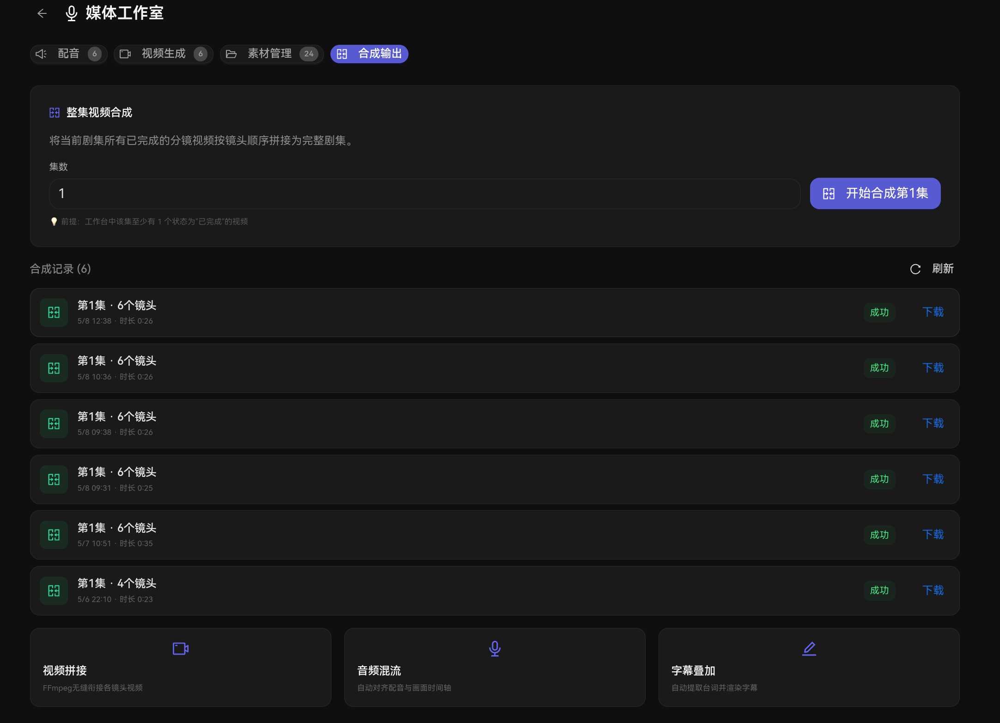

#### 7.8.2 Export Page Layout


| Area                           | Description                                                      |
| ------------------------------ | ---------------------------------------------------------------- |
| FFmpeg Status                  | Shows if FFmpeg is available (if not, export button is disabled) |
| Episode Selection              | Input to select episode to export                                |
| Start Export Button            | Submit export task                                               |
| Audio-Visual Alignment Details | Shows processing strategy for each shot after export             |
| Export Record List             | Shows historical export records                                  |

#### 7.8.3 Select Episode to Export

**Step 2**: In the "Episode" input field, select the episode to export (1-100).

#### 7.8.4 Confirm Storyboard Status

**Step 3**: The system displays the video status of all storyboards for that episode.


| Status        | Description                |
| ------------- | -------------------------- |
| ✅ Completed  | Video generation completed |
| ⏳ Processing | Video is being generated   |
| ❌ Failed     | Video generation failed    |

> **Prerequisite**: At least 1 video with "Completed" status is needed to start export

#### 7.8.5 Audio Processing Rules

The system automatically processes audio during export with the following rules:


| Video Source                            | Audio Processing Method                                       |
| --------------------------------------- | ------------------------------------------------------------- |
| MiniMax Generated (Silent)              | Automatically mix in corresponding storyboard's TTS voiceover |
| Doubao/Volcengine Generated (Has Audio) | **Keep original video's audio-video sync**, don't mix in TTS  |

> **Important Notes**:
>
> - Doubao/Volcengine's Seedance model generates **native audio-video sync videos**
> - During export, directly use the video's own audio, don't mix in TTS voiceover
> - This is to ensure Doubao video's audio-video sync effect

#### 7.8.6 Subtitle Overlay Description

During export, the system **automatically burns ASS subtitles** into the video based on the storyboard's dialogue.

---

#### 7.8.7 Start Export

**Step 4**: After confirming everything is ready, click the **「Start Exporting Episode X」** button.

#### 7.8.8 View Export Progress

**Step 5**: After export starts, export progress and audio-visual alignment details are shown.

**Export Progress Page Shows**:

```
Total 6 shots · Total duration 26.3s

#1  🔵 Freeze Extend  Video 6.0s + Voice 7.2s  →  Output 7.2s  [Dialogue...]
#2  🟢 Add Silence   Video 6.0s + Voice 3.1s  →  Output 6.0s  [Dialogue...]
#3  ⚪ Pure Visual   Video 6.0s (no voice)     →  Output 6.0s
```

**Strategy Icon Description**:


| Icon | Strategy Name      | Meaning                                                              |
| ---- | ------------------ | -------------------------------------------------------------------- |
| ✅   | Direct Merge       | Voice and video duration similar, direct splice                      |
| 🔵   | Freeze Extend      | Voice longer than video, freeze last frame to extend and match audio |
| 🟢   | Add Silence        | Video longer than voice, add silence after audio ends                |
| ⚪   | Pure Visual        | No voice, keep original video sound (Doubao video) or pure visual    |
| 🔴   | Fallback(Original) | Export failed, use original video                                    |
| 🟡   | Fallback(Simple)   | Simple splice mode                                                   |

---

#### 7.8.9 Export Complete

**Step 6**: After export completes:

- Success prompt is displayed
- Can view total duration, file size
- Can click "Download" button to download video
- Video automatically saves to configured storage location

---

#### 7.8.10 View Export History

**Step 7**: View historical exports in the "Export Records" area:


| Field        | Description                                          |
| ------------ | ---------------------------------------------------- |
| Status Label | Success (green) / Failed (red) / Processing (yellow) |
| Episode      | Episode X                                            |
| Shot Count   | Number of included storyboards                       |
| Duration     | Total video duration                                 |
| Time         | Export time                                          |
| Operation    | Download                                             |

---

## 8. FAQ

### Q1: What should be configured on the AI Configuration page?

**Answer**: At least the following four items need to be configured to fully use the platform:


| API Type  | Purpose                          | Required Note    |
| --------- | -------------------------------- | ---------------- |
| **text**  | Script analysis, scene splitting | ✅ Recommended   |
| **image** | Generate character/scene images  | ✅ Recommended   |
| **video** | Generate video clips             | ✅ Core function |
| **tts**   | Text-to-speech (voice)           | ✅ Recommended   |

---

### Q2: How long does "Processing" status take for video generation?

**Answer**: Video generation is an async task, usually taking **2-10 minutes**.


| Factors Affecting Duration | Description                                         |
| -------------------------- | --------------------------------------------------- |
| AI Vendor Queue            | Longer queue when vendor has many tasks             |
| Video Duration             | Longer duration, longer generation time             |
| Current System Load        | Number of tasks server is processing simultaneously |

---

### Q3: Which is better, MiniMax or Doubao/Volcengine?

**Answer**: Both vendors have their advantages. Choose based on your needs.


| Comparison Item         | MiniMax Hailuo                                      | Doubao/Volcengine Seedance |
| ----------------------- | --------------------------------------------------- | -------------------------- |
| **Audio-Video Sync**    | ❌ Video is silent, needs post-production voiceover | ✅ Native audio-video sync |
| **First-Last Frame**    | ✅ Supported (Hailuo 02)                            | ✅ Supported               |
| **Character Reference** | ✅ S2V-01 character consistency                     | ❌ Not supported           |
| **Duration Selection**  | 6s / 10s (fixed)                                    | 4-12s (slider adjustment)  |
| **Resolution**          | 512P-1080P                                          | 480P-1080P                 |
| **Pricing**             | Per second                                          | Per token                  |

**Selection Suggestions**:


| Requirement                                                   | Recommended Vendor       |
| ------------------------------------------------------------- | ------------------------ |
| Need**Lip-sync** effect                                       | Doubao/Volcengine        |
| Need**Character Consistency** (same character multiple shots) | MiniMax S2V-01           |
| Need**Quick Preview** (low duration)                          | Doubao/Volcengine 4s     |
| Need**Longer Video** (10s+)                                   | MiniMax 10s              |
| Want**Lowest Price**                                          | MiniMax Hailuo 02 + 512P |

---

### Q4: Some storyboards show "No Available Video" during export?

**Answer**: That storyboard hasn't generated video yet or video generation failed.

**Check Steps**:

1. Find that storyboard in the storyboard list, check the video column's status
2. If status is "failed", click to view error reason
3. Fix the problem based on error reason (e.g., update API Key, adjust parameters)
4. Regenerate video, wait for completion then try export again

---

### Q5: How to solve video generation failure?

**Answer**: Video generation may fail for the following reasons:


| Error Type            | Possible Cause                                      | Solution                                               |
| --------------------- | --------------------------------------------------- | ------------------------------------------------------ |
| Invalid API Key       | Key expired, filled incorrectly                     | Go to AI Config page to update API Key                 |
| Insufficient Balance  | Account balance insufficient                        | Recharge at AI vendor platform, then retry             |
| Unsupported Parameter | Model doesn't support current parameter combination | Adjust parameters (e.g., lower resolution), then retry |
| Network Timeout       | Unstable network connection                         | Wait and retry, usually temporary issue                |

---

### Q6: How to export completed drama video?

**Answer**: After export completes, video automatically saves to configured storage location.

**View Export Results**:

1. In Media Studio → Export → Export Records, view
2. Find the corresponding export record, click "Download" button

---

### Q7: What is a Grid Image for?

**Answer**: A Grid Image visualizes the storyboard's visual prompts in **4-grid or 6-grid comic form**.

**Grid Image Uses**:


| Purpose            | Description                                                              |
| ------------------ | ------------------------------------------------------------------------ |
| Quick Preview      | Quickly view overall visual effect before video generation               |
| Early Discovery    | Discover visual description problems early in production, adjust in time |
| Team Communication | Used for internal confirmation to avoid rework                           |

---

### Q8: How to choose the right video model?

**Answer**: Refer to the following based on your needs:


| Requirement               | Recommended Model            | Reason                             |
| ------------------------- | ---------------------------- | ---------------------------------- |
| **Lowest Price**          | Hailuo 02 + 512P + 6s        | ¥0.60 lowest price                |
| **Fastest Speed**         | Hailuo 2.3-Fast              | Fast version generates faster      |
| **First-Last Frame**      | Hailuo 02 or Doubao Seedance | Both support first-last frame      |
| **Character Consistency** | S2V-01                       | Maintain same character appearance |
| **Audio-Video Sync**      | Doubao Seedance 1.5 Pro      | Native audio-video sync            |
| **Lip-sync**              | Doubao Seedance 1.5 Pro      | Supports lip-sync                  |

---

## Appendix

### A. Page Index


| Page          | Path                  | Function Description                             |
| ------------- | --------------------- | ------------------------------------------------ |
| Drama List    | `/dramas`             | Manage all short drama projects                  |
| Drama Details | `/drama/:id`          | Complete production area for single drama        |
| Workbench     | `/workbench/:dramaId` | Storyboard editing, batch image/video management |
| Media Studio  | `/media/:dramaId`     | TTS voice, video generation, export              |
| AI Config     | `/settings/ai`        | Configure AI vendor API Keys                     |
| Storage       | `/settings/storage`   | Configure storage locations                      |
| Tasks         | `/settings/tasks`     | View async task progress                         |

---

### B. Glossary


| Term                    | Description                                                                    |
| ----------------------- | ------------------------------------------------------------------------------ |
| **Storyboard**          | A single shot in a short drama, each storyboard corresponds to one video clip  |
| **Prompt**              | Visual description words, used to tell AI what kind of画面 to generate         |
| **TTS**                 | Text-to-Speech, text to voice                                                  |
| **OSS**                 | Object Storage Service, object storage service (e.g., Alibaba Cloud OSS)       |
| **Async Task**          | Tasks executed in background, front-end submits without waiting for completion |
| **Audio-Video Sync**    | Alignment of audio and video timing                                            |
| **Grid Image**          | Multi-panel comic-style visual preview                                         |
| **Camera Movement**     | Camera movement method (push in, pull out, pan, etc.)                          |
| **Shot Size**           | Size range of shot画面 (wide, medium, close-up, extreme close-up)              |
| **Text-to-Video**       | Generate video directly from text description                                  |
| **Image-to-Video**      | Generate video based on image                                                  |
| **First-Last Frame**    | Provide start and end frames of video, AI generates transition                 |
| **Character Reference** | Generate video with reference character as subject                             |
| **Token**               | AI model billing unit                                                          |
| **Reference Image**     | Reference image for video generation                                           |

---

### C. Keyboard Shortcuts

> Feature under development, coming soon

---

### D. Video Generation Price Reference

> The following prices are for reference, actual charges prevail based on each AI vendor

**MiniMax Hailuo Models**:


| Model               | Duration | 512P   | 768P               | 1080P  |
| ------------------- | -------- | ------ | ------------------ | ------ |
| Hailuo 2.3 Standard | 6s       | ¥0.60 | ¥2.00             | ¥3.50 |
| Hailuo 2.3 Standard | 10s      | ¥1.00 | ¥4.00             | ¥4.00 |
| Hailuo 2.3-Fast     | 6s       | -      | ¥1.35             | ¥2.31 |
| Hailuo 2.3-Fast     | 10s      | -      | ¥2.25             | ¥2.31 |
| Hailuo 02           | 6s       | ¥0.60 | ¥2.00             | ¥3.50 |
| Hailuo 02           | 10s      | ¥1.00 | ¥4.00             | ¥4.00 |
| S2V-01              | 6s       | -      | ¥2.00 (720P only) | -      |

---

### E. Difference Between Reference Images and Video Generation Images


| Type                | Description                                        | Generation Method                                                                |
| ------------------- | -------------------------------------------------- | -------------------------------------------------------------------------------- |
| **Character Image** | Character's photo                                  | Generate in "Characters" tab                                                     |
| **Scene Image**     | Scene's background photo                           | Generate in "Scenes" tab                                                         |
| **Grid Image**      | Comic panel preview of storyboard画面              | Generate in storyboard details                                                   |
| **Reference Image** | Comprehensive reference image for video generation | Generate in workbench "Storyboard Editor", combines character and scene elements |

---

### F. AI Configuration Field Description


| Field           | Description                                   | Notes                                                    |
| --------------- | --------------------------------------------- | -------------------------------------------------------- |
| **Vendor**      | AI service provider                           | Must match the actual vendor used                        |
| **API Type**    | Purpose of this config                        | Same vendor can configure multiple types                 |
| **Base URL**    | API interface address                         | Must match vendor requirements, otherwise call will fail |
| **API Key**     | Access key                                    | Please keep safe, don't share                            |
| **Model Name**  | Specific model used                           | Must match API type                                      |
| **Priority**    | Call order when multiple configs of same type | Smaller number = higher priority, 0 is highest           |
| **Token Price** | Price per Token                               | Used for cost calculation, doesn't affect function       |

---

*Last Updated: May 2026*
